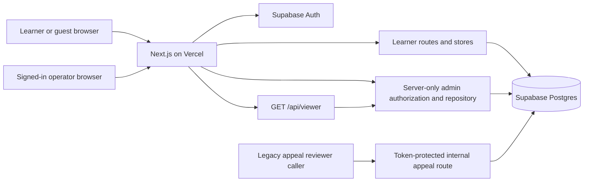
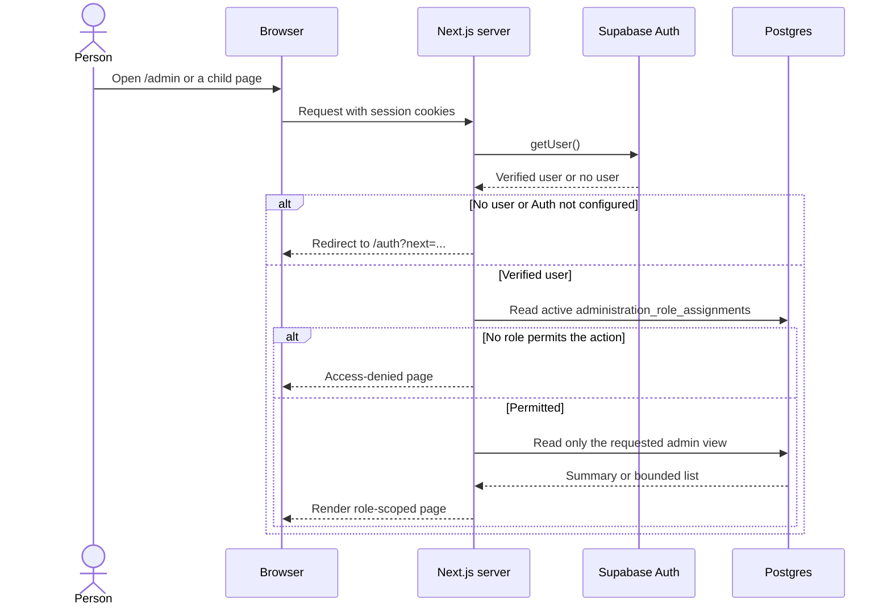
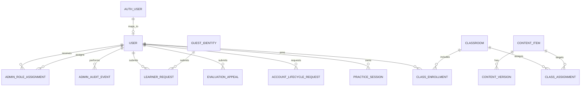

# Administration and Learner Architecture

This document describes the administration implementation on this branch as of
2026-09-20. It explains how an operator sees learner activity and how access is
enforced. [Administration use cases](ADMIN_USE_CASES.md) describes the journeys
and expected outcomes. [ADR-011](adr/011-current-platform-and-admin-console.md)
records the delivery sequence; later stages in that decision are not live.

## System context

The learner application and administration portal are routes in the same
Next.js application. They use the same Supabase Auth account, but an authenticated
learner becomes an operator only when a server-controlled database assignment
grants an administration role. A guest practice session is never an operator.

The browser never receives a database connection or an administration role
assignment table. The learner navigation receives only the Boolean
`canAccessAdministration` from `/api/viewer`; each admin page and mutation checks
permissions again on the server. The old appeal-resolution route is a separate
path and does not use the new operator session yet.

## Runtime components and ownership

| Component | Responsibility | Code |
|---|---|---|
| Supabase Auth and session | Verify the signed-in identity; refresh cookies through middleware. Guests use a separate HTTP-only guest cookie. | `apps/web/src/middleware.ts`, `apps/web/src/lib/auth/session.ts` |
| Learner routes | Accept practice, feedback, appeal, and account-lifecycle requests; resolve the owning user or guest before reading or writing. | `apps/web/src/app/api` |
| Admin layout and pages | Require an operator role and render only the areas permitted to that role. | `apps/web/src/app/admin`, `apps/web/src/components/admin` |
| Permission policy | Map administration actions to roles. Permission names for future actions do not mean those workflows are implemented. | `packages/domain/src/administration.ts` |
| Server authorization | Call `getSession()`, load active role assignments, check the requested action, then invoke a repository read or mutation. | `apps/web/src/lib/admin/authorization.ts` |
| Administration repository | Query bounded summaries and lists; change roles and append audit events in one PostgreSQL transaction. | `packages/database/src/repositories/administration.repository.ts` |
| Classroom repository | Generate class codes, enroll signed-in learners, assign published practice activities, and derive task completion from practice sessions. | `packages/database/src/repositories/classroom.repository.ts` |
| Database schema | Store role assignments and audit events; keep learner, content, job, feedback, appeal, and privacy records in their existing tables. | `packages/database/migrations/1789430157595_admin-portal-foundation.ts` |
| First-admin command | Grant the first administrator role to an already confirmed Supabase Auth account, once. | `scripts/bootstrap-admin.mjs` |

## Authentication and authorization path

The layout first checks `administration.access`. Each child page checks its own
action (`users.read`, `content.read`, `operations.read`, `support.read`,
`privacy.read`, or `audit.read`). The server action for role changes checks
`administration.manage`. A hidden navigation link is a convenience, not the
authorization boundary. Signed-out users go to sign-in; signed-in users without
the required role see an access-denied view. Database failures do not grant
access; admin page errors have a retry view.

`getSession()` verifies the user through Supabase Auth and ensures a matching
application `users` row exists. The returned learner role is not used as an
operator grant. Active assignments are read from the database on each admin
access; browser metadata and client-side state cannot grant a role.

## Role and page matrix

| Role | Admin pages currently available | Additional policy actions defined, without a current portal workflow |
|---|---|---|
| `content_author` | Overview, Content | `content.write` |
| `content_reviewer` | Overview, Content | `content.publish` |
| `rights_reviewer` | Overview, Content | `content.publish` |
| `evaluator_reviewer` | Overview, Operations and appeal metadata | `evaluation.review` |
| `support` | Overview, People, Feedback | None |
| `privacy_operator` | Overview, People, Privacy | `privacy.export` |
| `administrator` | All admin pages and role editor | `content.write`, `content.publish`, `evaluation.review`, `privacy.export`, `feature.manage` |

`administrator` also grants `classes.read` and `classes.manage`. Other operator
roles cannot create or inspect classes through the administration portal.

The policy also defines `evaluation.read` for evaluator reviewers and
administrators. It controls the appeal count on the overview; the Operations
page is guarded by `operations.read`. A person may have multiple roles, and any
role granting an action is sufficient. Only `administrator` grants
`administration.manage` and `audit.read`.

## What the current pages read and change

| Route | Source and visible data | Current change capability |
|---|---|---|
| `/admin` | Counts of accounts, recent signups, active practice, open feedback, pending appeals, queued evaluation/execution jobs, and pending privacy requests. Metrics and area links are filtered by role. | None |
| `/admin/classes` and `/admin/classes/[classId]` | Active classes, join codes, enrolled learners, assigned practice, due dates, and completion counts. | Administrators create classes and assign tasks with an audit reason. |
| `/admin/users` | Latest 50 application users, email, join date, and active operator roles. | Administrators can replace a user's complete role set with a reason. |
| `/admin/content` | Latest 50 content items and latest version metadata. | None; no editor or publisher. |
| `/admin/operations` | Evaluation and execution queue counts/oldest queued times; latest 50 appeal metadata rows. | None; no appeal decision in this portal. |
| `/admin/feedback` | Latest 50 learner request titles, types, submitter labels, dates, and statuses. | None; no response or status change. |
| `/admin/privacy` | Latest 50 account export/deletion request metadata rows. | None; no export or deletion execution. |
| `/admin/audit` | Latest 100 privileged audit events, including actor display name, action, target, reason, and request ID. | None. |
| `/classes` | Only the signed-in learner's enrollments, assignments, due dates, and completion status. | Learner joins a class by code. |

Lists are bounded, ordered by recent date, and currently have no pagination or
search. The admin views do not show learner source code, full feedback
descriptions, appeal context, generated exports, passwords, or tokens. The People
page does show account email to permitted operators. The audit view exposes the
reason supplied for a role change, so that reason should contain no sensitive
learner content.

## Data model and trust boundaries

- `administration_role_assignments` has a user ID, role, assigner, assignment
  time, and nullable revocation time. Only non-revoked rows grant access; a
  partial unique index prevents duplicate active user/role pairs.
- `administration_audit_events` stores actor, action, target, reason, request ID,
  metadata, and creation time. The role editor records before/after role arrays.
- Both new tables have RLS enabled and table privileges revoked from `PUBLIC`,
  `anon`, and `authenticated`. Server-only PostgreSQL repository code reads them
  through the configured database connection. These tables are not browser Data
  API resources.
- Learner requests belong to a verified application user or a validated guest
  identity; account lifecycle requests and appeals require a signed-in user.
  Learner reads are owner-scoped in their server routes. Where a Supabase Data
  API policy exists for learner requests, it also restricts authenticated access
  to the owner's user ID.
- The administration repository reads cross-user metadata only after its
  server permission check. Its database connection is privileged relative to
  browser access, so every new repository operation must retain that check and
  minimize selected fields.
- Class codes are generated from 60 random bits on the server. New classroom
  tables have RLS enabled and direct `anon`/`authenticated` table privileges
  revoked. The server resolves a signed-in user before accepting a join code;
  learner queries filter enrollments by that user ID. The code is visible only
  to an authorized administrator and whoever they share it with.

## Classroom and task lifecycle

1. An administrator creates a class. The server generates a unique 12-character
   join code and writes the class plus an administration audit event in one
   transaction.
2. A signed-in learner enters the code at `/classes`. The server normalizes its
   case and optional separator, finds an active class, and inserts one enrollment
   per learner and class. Reusing the code is idempotent. Guest sessions cannot
   enroll.
3. An administrator selects an existing published practice activity, supplies a
   task title, optional instructions and due date, and an audit reason. The task
   and audit event commit together. The same activity can be assigned once per
   class in this first release.
4. The learner opens the assigned activity in the normal practice workspace.
   The task shows as complete when any owned practice session for that activity
   has `status = 'completed'`, which currently requires passing verified code
   tests. Earlier verified completion counts too. The class roster and task
   counts derive from the same session status; they do not copy learner code.

The first slice does not include manual grading, submissions as separate class
objects, individual learner assignments, code rotation, class archiving controls,
or a requirement to join a class before using regular practice.

## Role assignment and audit transaction

1. The first administrator must have a confirmed Supabase Auth account. The
   one-time `pnpm admin:bootstrap -- <email> <reason>` command assigns the role
   and writes a bootstrap audit event in one transaction. It refuses to run if
   an active administrator exists. The migration also carried forward legacy
   `users.role = 'admin'` rows as active assignments; those backfilled rows do
   not represent a new interactive grant.
2. An administrator opens `/admin/users`, selects the target's complete role
   set, and supplies a reason of 8–500 characters. The server validates the
   target UUID and role names and rechecks `administration.manage`.
3. The repository locks role assignments, revokes roles omitted from the new
   set, inserts newly selected roles, and writes an audit event with actor,
   target, reason, request ID, and before/after roles. These writes commit or
   roll back together. Removal of the final administrator is rejected.
4. The next admin request reads current assignments, so a newly granted or
   revoked role affects subsequent server authorization without relying on a
   refreshed JWT role claim. The page revalidates after a successful edit.

## Current limits and next boundary

- The portal can inspect operational queues but cannot resolve appeals, triage
  feedback, publish content, execute privacy requests, or change feature flags.
- The internal appeal-resolution endpoint still accepts a shared
  `EVALUATION_REVIEWER_TOKEN` and a caller-provided reviewer ID. It writes its
  own appeal audit record. It is not connected to the admin UI or the new
  administration audit log. ADR-011 stage 3 calls for replacing this boundary
  with signed-in, reason-required, permission-checked actions.
- The role policy contains future action names; implementing an action still
  requires a server route or action, object authorization, transactional audit,
  and user-facing workflow.
- Production deployment readiness alone does not confirm that the initial
  administrator has been provisioned or that every environment has its database
  migration applied. Verify those operational steps in the target environment.
