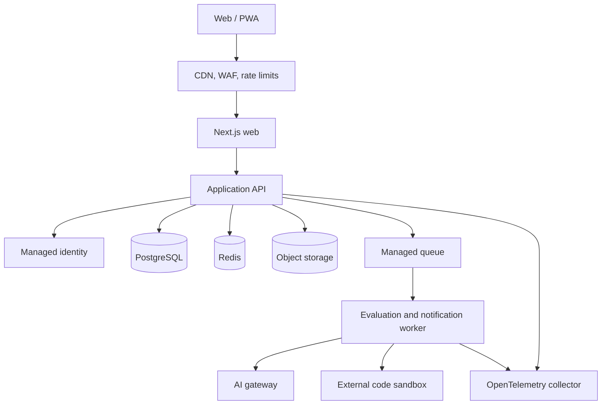
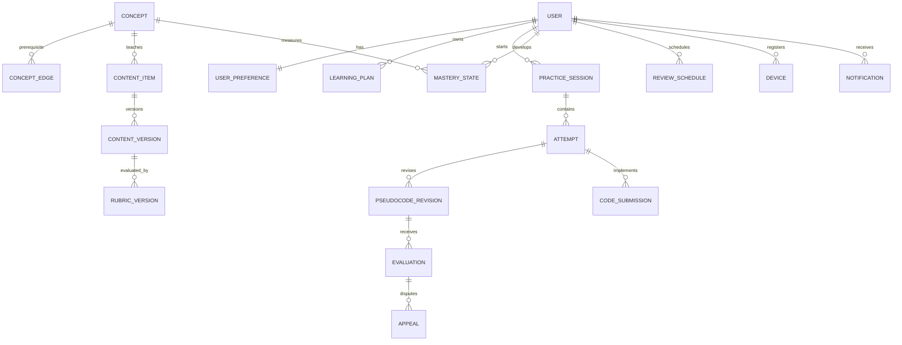

# Target Architecture

This document turns the product architecture in [PRODUCT_PLAN.md](PRODUCT_PLAN.md) into implementable boundaries. It describes the target state; the current repository is still a guest-only web walking skeleton.

## Architectural principles

1. Keep the core product a modular monolith until scale or security creates a proven need to split it.
2. Separate untrusted code execution and asynchronous evaluation from request-serving processes.
3. Keep domain rules in shared TypeScript modules, not React components or route handlers.
4. Treat content, rubrics, prompts, schemas, and recommendation logic as versioned product artifacts.
5. Use managed services for identity, PostgreSQL, queues, object storage, email, and observability.
6. Use short-lived workload identity for deployment. Never ship provider credentials to browsers.

## Repository target

```text
apps/
  web/                 Next.js web and PWA
  api/                 HTTP API modular monolith
  worker/              Evaluation, notification, export, and analytics jobs
  admin/               Content and support operations UI
packages/
  domain/              Entities, policies, value objects, and domain events
  contracts/           API schemas, events, evaluator schemas, generated clients
  pseudocode/          Grammar, AST, parser, formatter, static analysis, migrations
  evaluator/           Rubric engine, evidence merger, and unlock policy
  recommendations/     Mastery and next-activity scoring
  content/             Original seed content, manifests, and provenance schemas
  ui/                  Shared accessible web components and design tokens
  observability/       Logging, tracing, metrics, and redaction helpers
infra/
  modules/             Reusable infrastructure modules
  environments/        Development, staging, and production composition
scripts/               Reproducible local and operational scripts
docs/                  Product, architecture, runbooks, and decisions
```

Create packages only when the first consuming feature needs them. Do not move the current UI merely to match this tree.

## Runtime topology



For the first persistent release, API routes may live in Next.js if they call the same domain services and contracts planned for `apps/api`. Extract the API only when background processing, scaling, or deployment ownership benefits from it.

## Domain boundaries

| Module | Owns | Does not own |
|---|---|---|
| Identity | User reference, preferences, devices, consent | Provider passwords or OAuth tokens |
| Content | Concepts, activities, immutable versions, provenance | Learner attempts |
| Learning | Plans, sessions, attempts, revisions, reflections | Rubric implementation |
| Pseudocode | Text/block AST, parsing, formatting, static analysis | Problem-specific pass thresholds |
| Evaluation | Rubrics, findings, evidence, confidence, appeals, unlock | Raw provider-specific AI calls |
| Mastery | Concept evidence and interpretable scores | Content publication |
| Recommendation | Candidate scoring and explanations | Mastery event collection |
| Execution | Code submissions and sandbox outcomes | Running code in API processes |
| Notification | Preferences, schedules, templates, delivery results | Learning-plan decisions |
| Administration | Review queues, feature flags, audit views | Bypassing domain authorization |
| Privacy | Export and deletion orchestration | Indefinite retention |

Cross-module writes occur through application services and domain events, not direct table manipulation from unrelated modules.

## Core data model

Use PostgreSQL with UUID primary keys, UTC timestamps, explicit lifecycle states, and optimistic concurrency on mutable learner documents.



### Versioning rules

- `ContentVersion`, `RubricVersion`, evaluator prompt, AST schema, and recommendation policy are immutable after publication.
- Every attempt records the exact content and rubric versions used.
- Every evaluation records deterministic-engine, prompt, model, and schema versions.
- Pseudocode revisions are append-only; a current-revision pointer supports resume.
- Destructive user deletion is asynchronous, auditable, and propagated to backups according to policy.

## Pseudocode representation

Start with a small, versioned AST rather than a complete programming language.

```ts
type PseudocodeNode =
  | { type: "declare"; name: string; value?: Expression }
  | { type: "assign"; target: Reference; value: Expression }
  | { type: "forEach"; item: string; collection: Expression; body: PseudocodeNode[] }
  | { type: "if"; condition: Expression; then: PseudocodeNode[]; otherwise?: PseudocodeNode[] }
  | { type: "return"; value?: Expression }
  | { type: "assert"; condition: Expression; label?: string }
  | { type: "complexity"; time?: string; space?: string }
  | { type: "intent"; text: string; confidence: number };
```

Each node includes a stable ID and source span. Text and blocks edit the same AST. Unsupported text becomes an intent node rather than being discarded.

## Evaluation pipeline

1. Validate the attempt and content/rubric versions.
2. Parse text or accept block AST.
3. Run syntax, data-flow, control-flow, and complexity checks.
4. Trace bounded authored examples and counterexamples.
5. Apply problem-specific deterministic rubric rules.
6. If enabled, submit minimized and redacted context to the AI gateway.
7. Validate AI output against a strict schema.
8. Merge findings with deterministic evidence taking precedence.
9. Apply confidence and unlock policy.
10. Persist the evaluation and emit mastery/recommendation events.

The AI provider never writes evaluation state directly. The worker owns timeouts, retries, budgets, redaction, and provider fallback.

## API conventions

- Prefix public APIs with `/v1`.
- Validate request and response bodies from shared schemas.
- Authorize every object lookup by ownership or explicit role.
- Use idempotency keys for session creation, evaluation requests, code runs, exports, and deletion.
- Return `202 Accepted` plus a job ID for evaluation, execution, export, and deletion jobs.
- Use cursor pagination for history and admin queues.
- Include correlation IDs in responses and logs.
- Never log raw pseudocode, code, tokens, email addresses, or model prompts by default.

## Security boundaries

### Browser

Only public content and short-lived session state belong in the client. Variables prefixed with `NEXT_PUBLIC_` are public. No AI, database, email, sandbox, or object-storage credentials may use that prefix.

### API and workers

Use managed identity or workload identity where supported. Resolve secrets at runtime from the deployment platform or managed secret store. Apply per-user and per-IP quotas before queueing expensive work.

### Code execution

Use an external sandbox initially. Disable outbound networking and arbitrary package installation. Enforce CPU, memory, process, filesystem, output, and wall-clock limits. The sandbox receives no application credentials and cannot reach production data services.

### Content and AI

Treat learner input, authored content, and retrieved context as untrusted data. Delimit data from instructions, schema-validate model output, redact sensitive patterns, and retain only the minimum evaluation record.

## Environments

| Environment | Data | Deployment | Purpose |
|---|---|---|---|
| Local | Synthetic seed data | Developer machine | Fast feature work |
| Preview | Synthetic, isolated | Pull request | UI and contract review |
| Development | Shared synthetic | Automatic from `main` | Integration |
| Staging | Production-like synthetic | Promoted artifact | Release validation |
| Production | Real user data | Approved promotion | Public service |

Never copy production data into lower environments. Artifact promotion must record commit SHA, image digest, schema version, content manifest, and evaluator version.

## Architecture decisions to record

Create an ADR before implementing each choice:

1. Monorepo tooling and package boundaries.
2. Identity provider and guest-to-account merge semantics.
3. PostgreSQL provider and migration tool.
4. Queue and worker runtime.
5. AI provider abstraction and retention policy.
6. Sandbox provider and isolation limits.
7. Content source of truth and publication workflow.
8. Hosting, region, infrastructure-as-code tool, and deployment identity.
9. Telemetry provider and redaction policy.
10. Email/push providers and consent model.

Use `docs/adr/NNNN-short-title.md` with context, decision, alternatives, consequences, owner, and review date.
