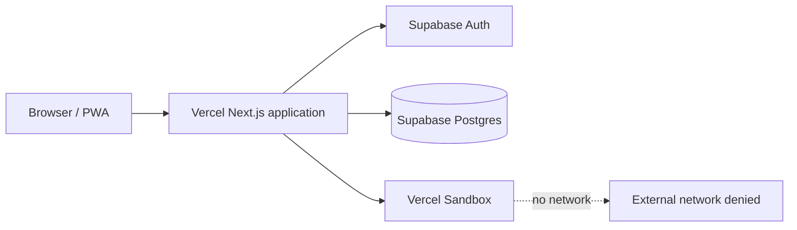
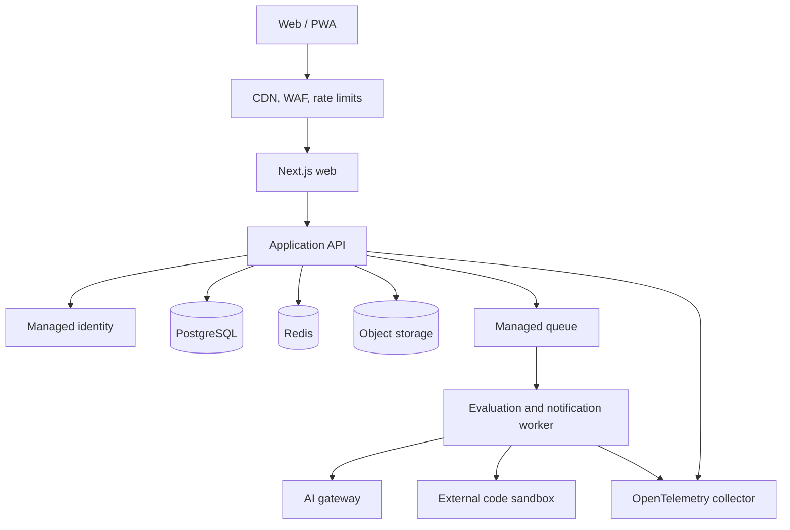
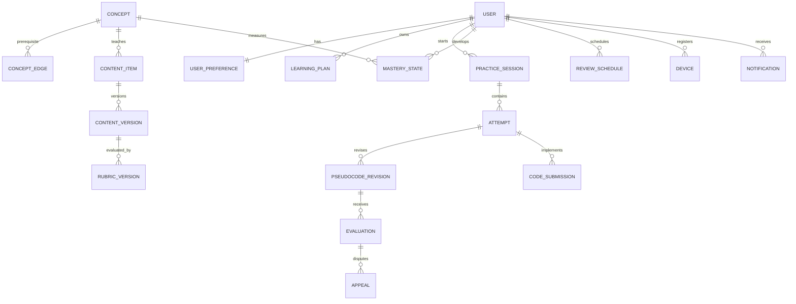

# Current and Target Architecture

This document describes both the deployed system and its longer-term boundaries.
For a code-oriented handoff, start with [the maintainer quick start](USAGE.md).
The repository is no longer a guest-only skeleton; sections labeled as target
state remain intentionally aspirational.

## Current deployed system


```mermaid
flowchart LR
  Browser[Browser / PWA] --> Vercel[Vercel Next.js application]
  Vercel --> Auth[Supabase Auth]
  Vercel --> DB[(Supabase Postgres)]
  Vercel --> Sandbox[Vercel Sandbox]
  Sandbox -. no network .-> Blocked[External network denied]
```

| Boundary | Current implementation |
|---|---|
| Web and API | One Next.js modular monolith in `apps/web`, deployed from `main` to Vercel |
| Identity | Supabase email/password Auth with server-side cookie refresh and guest-to-account merge code |
| Data | Supabase Postgres accessed through server-only repository code; `node-pg-migrate` migrations live in `packages/database/migrations` |
| Evaluation | Deterministic evaluator and database-backed job foundations; optional AI path remains disabled by default |
| Code execution | Ephemeral Vercel Sandbox microVMs for Python 3, C++20, and TypeScript, with network denied and bounded runtime/output |
| Personalization | Explainable deterministic ranking using profile, practice history, review age, and local mastery evidence |
| Offline behavior | Network-first navigation with a self-contained cached fallback; application drafts also use guarded browser storage |
| Administration | `/admin` uses Supabase sessions plus database role assignments for least-privilege server authorization; read-only operational views, audited role management, and administrator-managed classes are available, while appeal resolution still uses the legacy reviewer token |
| Classes | Server-generated codes link signed-in learners to classes; instructors manage their own classes, submissions, recipient excusals, and gradebooks at `/teach`, learners see published grades and applicability at `/classes/[classId]/grades`, and platform administrators manage all classes at `/admin/classes` |

Instructor opt-in updates only the verified user's learner role to instructor
and records an audit event in the same transaction. It never grants platform
administration roles. Instructor reads and writes use a classroom repository
scoped to the authenticated owner's ID; role selection in the signup form is
only routing intent. This reuses the existing ownership columns and server-only
database boundary. The development-only admin preview uses in-memory sample
data and returns 404 in production.

### Gradebook calculation boundary

`packages/domain/src/gradebook.ts` provides a pure points-based calculation
foundation, exported from `@leetcode-app/domain`. The owner-scoped
`readClassGradebook` projection reads a repeatable snapshot and supplies the
instructor matrix at `/teach/[classId]/gradebook`; learner projections expose
only the signed-in learner's published results. The domain function itself does
not grant access or publish grades. Existing content-level completion counters
are not assignment grades.

Policies pin assignment, content, rubric/verifier versions, maximum points,
and attempt selection. `freezeAssignmentGradePolicy` validates and copies them
into deeply frozen objects; the persistence boundary below stores these snapshots.
Scored outcomes identify the attempt, response revision, evaluator,
and grade revision. Missing-work zeros require an explicit attributable reason.

Points use integer hundredths and reject unsafe ranges. `parseGradePoints`
accepts decimal strings without floating-point conversion. Totals round half-up
to two decimal places for display; ranking compares exact ratios using integer
cross-products. Empty denominators are unknown. Published partial totals carry
coverage and cannot become a rank until the same declared assignment set has
published, undisputed numeric outcomes. Excused/not-assigned work changes the
personal denominator and excludes that learner from the default comparison set.
Ties use competition ranking (1, 1, 3); input ordering does not break a tie.

This deliberately supports points-based totals and binary verified-completion
or reviewed-rubric policies first. Category weights, curves, bonus points,
automated late penalties, attempt selection execution, persistence, and grade
publication workflows are not implemented by this module. Every caller supplies
one explicit current-outcome cell per learner/assignment, including nonnumeric
states; missing cells and mismatched policy versions fail rather than silently
dropping work from the denominator. A previous published revision can be shown
separately by a future UI, but cannot substitute for an unresolved current outcome
in a new comparison snapshot.

### Gradebook persistence boundary

The server-only `PostgresGradebookRepository` stores one immutable published
policy and content snapshot per assignment, explicit recipient snapshots,
assignment-specific response revisions, reviewed grade revisions, immutable
applicability and dispute events, and publication history. It does not backfill grades
from private practice. It is wired to
recipient-scoped learner submissions, the
leased assignment-verification worker, instructor review/publication routes,
the instructor matrix, and the learner published-grade view.

Every instance requires a verified learner or instructor identity. Instructor
queries enforce class ownership; learner queries enforce recipient ownership.
There is no implicit global administrator scope. All gradebook tables enable RLS
and revoke browser-role privileges; authorization still runs in server SQL because
the server connection is privileged. Composite foreign keys prevent attempts,
grades, and publications from crossing recipients or policies.

Recipient locks serialize submissions, corrections, and publication. Request
keys make retries idempotent; changing a retried payload is a conflict. Grade
corrections and publication also require the expected prior revision. History
reads use a repeatable-read transaction. Policies, responses, and published
evidence cannot be updated in place. Content is copied at policy publication,
so editing source content does not rewrite an existing assignment's evidence.

Applicability follows the same append-only model. Every recipient begins with a
system-authored `assigned` revision. Only the owning instructor can append a
reasoned `excused` or restored `assigned` revision, using the expected prior
revision and a request key. Excusing preserves attempts, grades, publications,
and the complete applicability chain, supersedes active verification jobs, and
blocks new submissions, grades, and publications until assignment is restored.

Grade disputes are an append-only chain tied to the exact published grade under
review. The owning learner can submit one active dispute and later withdraw it;
the class owner can mark it in review and resolve it as upheld or changed. A
changed outcome requires a separately created and published replacement grade,
and publishing that correction does not silently close the dispute: the
instructor must append the explicit resolution event. Expected-event identifiers
provide optimistic concurrency, recipient locks serialize changes, and request
keys make identical retries idempotent while rejecting changed retry payloads.
Submitting a newer attempt or excusing the assignment appends a system-authored
supersession event so stale disputes cannot remain active.

The first persistence adapter accepts latest-attempt policies. Human rubric
scores must cover every criterion and stay within its maximum. Verified-completion
scores are written only by the trusted assignment worker from the policy's
pinned verifier and test snapshot; a caller cannot supply a pass flag.
Missing-work zero requires no submission, an elapsed explicit closing time,
and an instructor reason. New submissions use database receipt time and require
live enrollment and an active class. Withdrawal preserves history. Publishing a
grade for an older attempt is rejected when a newer submission exists.

Students see their own attempts and published grade history, including earlier
publications after a new submission. That history is not the current gradebook
projection: consumers must represent the new pending attempt explicitly, never
reuse an old published score as a current finalized outcome. Unpublished
corrections remain instructor-only. The live instructor projection calculates
published totals, coverage, and comparable ranks without persisting a snapshot.
Current excusals appear as an explicit nonnumeric state, remove that assignment
from the learner's denominator, and exclude the learner from comparisons that
require a common assignment set. An active dispute leaves the already published
score in the learner's displayed total and coverage while excluding that learner
from comparable ranking; resolution restores comparability against the current
published outcome. Recipient history exposes only the public dispute message and
status fields, never request keys, audit reasons, actor identities, or instructor
private grade notes. Learners remain restricted to their own recipient and
instructors to classes they own. Authenticated learner routes expose only open
and withdraw transitions. They require exact request bodies, a trimmed 20–4,000
character reason when opening, the expected dispute event for optimistic
concurrency, and a request key; stale transitions fail with a conflict. The
published grade card presents an accessible inline form plus the learner-visible
request, status, and response history. Durable ranking snapshots, broader
accommodations, policy replacement, best-attempt selection, class-wide
publication, and the instructor dispute screen remain separate workflows.

Verified-completion submissions use a dedicated assignment queue. The learner
submission transaction creates the immutable attempt and queue record together,
using the policy's pinned verifier version and copied test suite. The browser
supplies only source, language, and an idempotency key at its recipient-scoped
route; it cannot supply learner, policy, verifier, test, or grading identifiers.
This queue never reads private practice sessions or the general execution queue.

Workers claim jobs with expiring lease tokens. Completion, retry, and terminal
unavailability compare the active lease, preventing a late worker from changing
a reclaimed job. A completed verifier run appends a binary zero/full grade only
when its attempt is still the latest submission. A newer attempt supersedes the
older job. Provider failures retry within a bounded budget and then remain
unavailable without creating a grade. Raw hidden tests and sandbox output stay
server-side; stored summaries contain only bounded outcome metadata.
The first worker adapter, `stdin-stdout-v1`, accepts at most five bounded
stdin/expected-stdout cases and runs them in the configured isolated sandbox.
Unknown adapter versions and malformed suites remain unavailable.
Submission admission is serialized and counted in PostgreSQL at five new
attempts per learner per ten minutes, so serverless instance churn cannot reset
the execution budget. Idempotent retries do not consume another slot.

Database update triggers enforce immutability, while authorized account/class
deletion cascades can erase learner records. Staff attribution follows existing
audit retention constraints. The repository exposes no deletion API. This keeps
normal corrections append-only without blocking learner account erasure.

[ADR-011](adr/011-current-platform-and-admin-console.md) records the current
provider choices and the administration boundary. It supersedes older provider
choices where they conflict with this deployed topology.

## Architectural principles

1. Keep the core product a modular monolith until scale or security creates a proven need to split it.
2. Separate untrusted code execution and asynchronous evaluation from request-serving processes.
3. Keep domain rules in shared TypeScript modules, not React components or route handlers.
4. Treat content, rubrics, prompts, schemas, and recommendation logic as versioned product artifacts.
5. Use managed services for identity, PostgreSQL, queues, object storage, email, and observability.
6. Use short-lived workload identity for deployment. Never ship provider credentials to browsers.

## Repository target

```text
apps/
  web/                 Next.js web and PWA
  api/                 HTTP API modular monolith
  worker/              Evaluation, notification, export, and analytics jobs
  admin/               Content and support operations UI
packages/
  domain/              Entities, policies, value objects, and domain events
  contracts/           API schemas, events, evaluator schemas, generated clients
  pseudocode/          Grammar, AST, parser, formatter, static analysis, migrations
  evaluator/           Rubric engine, evidence merger, and unlock policy
  recommendations/     Mastery and next-activity scoring
  content/             Original seed content, manifests, and provenance schemas
  ui/                  Shared accessible web components and design tokens
  observability/       Logging, tracing, metrics, and redaction helpers
infra/
  modules/             Reusable infrastructure modules
  environments/        Development, staging, and production composition
scripts/               Reproducible local and operational scripts
docs/                  Product, architecture, runbooks, and decisions
```

Create packages only when the first consuming feature needs them. Do not move the current UI merely to match this tree.

## Runtime topology


```mermaid
flowchart TB
  Browser[Web / PWA] --> Edge[CDN, WAF, rate limits]
  Edge --> Web[Next.js web]
  Web --> API[Application API]
  API --> Identity[Managed identity]
  API --> Postgres[(PostgreSQL)]
  API --> Redis[(Redis)]
  API --> Objects[(Object storage)]
  API --> Queue[Managed queue]
  Queue --> Worker[Evaluation and notification worker]
  Worker --> AIGateway[AI gateway]
  Worker --> Sandbox[External code sandbox]
  API --> Telemetry[OpenTelemetry collector]
  Worker --> Telemetry
```

For the first persistent release, API routes may live in Next.js if they call the same domain services and contracts planned for `apps/api`. Extract the API only when background processing, scaling, or deployment ownership benefits from it.

## Domain boundaries

| Module | Owns | Does not own |
|---|---|---|
| Identity | User reference, preferences, devices, consent | Provider passwords or OAuth tokens |
| Content | Concepts, activities, immutable versions, provenance | Learner attempts |
| Learning | Plans, sessions, attempts, revisions, reflections | Rubric implementation |
| Pseudocode | Text/block AST, parsing, formatting, static analysis | Problem-specific pass thresholds |
| Evaluation | Rubrics, findings, evidence, confidence, appeals, unlock | Raw provider-specific AI calls |
| Mastery | Concept evidence and interpretable scores | Content publication |
| Recommendation | Candidate scoring and explanations | Mastery event collection |
| Execution | Code submissions and sandbox outcomes | Running code in API processes |
| Notification | Preferences, schedules, templates, delivery results | Learning-plan decisions |
| Administration | Review queues, feature flags, audit views | Bypassing domain authorization |
| Privacy | Export and deletion orchestration | Indefinite retention |

Cross-module writes occur through application services and domain events, not direct table manipulation from unrelated modules.

## Core data model

Use PostgreSQL with UUID primary keys, UTC timestamps, explicit lifecycle states, and optimistic concurrency on mutable learner documents.


```mermaid
erDiagram
  USER ||--|| USER_PREFERENCE : has
  USER ||--o{ LEARNING_PLAN : owns
  USER ||--o{ PRACTICE_SESSION : starts
  CONCEPT ||--o{ CONCEPT_EDGE : prerequisite
  CONCEPT ||--o{ CONTENT_ITEM : teaches
  CONTENT_ITEM ||--o{ CONTENT_VERSION : versions
  CONTENT_VERSION ||--o{ RUBRIC_VERSION : evaluated_by
  PRACTICE_SESSION ||--o{ ATTEMPT : contains
  ATTEMPT ||--o{ PSEUDOCODE_REVISION : revises
  PSEUDOCODE_REVISION ||--o{ EVALUATION : receives
  EVALUATION ||--o{ APPEAL : disputes
  ATTEMPT ||--o{ CODE_SUBMISSION : implements
  USER ||--o{ MASTERY_STATE : develops
  CONCEPT ||--o{ MASTERY_STATE : measures
  USER ||--o{ REVIEW_SCHEDULE : schedules
  USER ||--o{ DEVICE : registers
  USER ||--o{ NOTIFICATION : receives
```

### Versioning rules

- `ContentVersion`, `RubricVersion`, evaluator prompt, AST schema, and recommendation policy are immutable after publication.
- Every attempt records the exact content and rubric versions used.
- Every evaluation records deterministic-engine, prompt, model, and schema versions.
- Pseudocode revisions are append-only; a current-revision pointer supports resume.
- Destructive user deletion is asynchronous, auditable, and propagated to backups according to policy.

## Pseudocode representation

Start with a small, versioned AST rather than a complete programming language.

```ts
type PseudocodeNode =
  | { type: "declare"; name: string; value?: Expression }
  | { type: "assign"; target: Reference; value: Expression }
  | { type: "forEach"; item: string; collection: Expression; body: PseudocodeNode[] }
  | { type: "if"; condition: Expression; then: PseudocodeNode[]; otherwise?: PseudocodeNode[] }
  | { type: "return"; value?: Expression }
  | { type: "assert"; condition: Expression; label?: string }
  | { type: "complexity"; time?: string; space?: string }
  | { type: "intent"; text: string; confidence: number };
```

Each node includes a stable ID and source span. Text and blocks edit the same AST. Unsupported text becomes an intent node rather than being discarded.

## Evaluation pipeline

1. Validate the attempt and content/rubric versions.
2. Parse text or accept block AST.
3. Run syntax, data-flow, control-flow, and complexity checks.
4. Trace bounded authored examples and counterexamples.
5. Apply problem-specific deterministic rubric rules.
6. If enabled, submit minimized and redacted context to the AI gateway.
7. Validate AI output against a strict schema.
8. Merge findings with deterministic evidence taking precedence.
9. Apply confidence and unlock policy.
10. Persist the evaluation and emit mastery/recommendation events.

The AI provider never writes evaluation state directly. The worker owns timeouts, retries, budgets, redaction, and provider fallback.

## API conventions

- Prefix public APIs with `/v1`.
- Validate request and response bodies from shared schemas.
- Authorize every object lookup by ownership or explicit role.
- Use idempotency keys for session creation, evaluation requests, code runs, exports, and deletion.
- Return `202 Accepted` plus a job ID for evaluation, execution, export, and deletion jobs.
- Use cursor pagination for history and admin queues.
- Include correlation IDs in responses and logs.
- Never log raw pseudocode, code, tokens, email addresses, or model prompts by default.

## Security boundaries

### Browser

Only public content and short-lived session state belong in the client. Variables prefixed with `NEXT_PUBLIC_` are public. No AI, database, email, sandbox, or object-storage credentials may use that prefix.

### API and workers

Use managed identity or workload identity where supported. Resolve secrets at runtime from the deployment platform or managed secret store. Apply per-user and per-IP quotas before queueing expensive work.

### Code execution

Use an external sandbox initially. Disable outbound networking and arbitrary package installation. Enforce CPU, memory, process, filesystem, output, and wall-clock limits. The sandbox receives no application credentials and cannot reach production data services.

Practice completion is a server-owned decision. The browser submits source code to the session verification endpoint; the API appends the activity's versioned test harness, applies server-owned limits, and runs it in the configured sandbox. Only a valid all-tests-passing report can mark the session complete. Raw execution remains an asynchronous job for exploratory runs, while verified practice grading returns the bounded structured report needed by the active workspace.

For guest learners, versioned concept evidence is stored locally and feeds the deterministic recommendation policy. Signed-in persistence and cross-device mastery remain server responsibilities; neither recommendation path requires a neural network.

### Content and AI

Treat learner input, authored content, and retrieved context as untrusted data. Delimit data from instructions, schema-validate model output, redact sensitive patterns, and retain only the minimum evaluation record.

## Environments

| Environment | Data | Deployment | Purpose |
|---|---|---|---|
| Local | Synthetic seed data | Developer machine | Fast feature work |
| Preview | Synthetic, isolated | Pull request | UI and contract review |
| Development | Shared synthetic | Automatic from `main` | Integration |
| Staging | Production-like synthetic | Promoted artifact | Release validation |
| Production | Real user data | Approved promotion | Public service |

Never copy production data into lower environments. Artifact promotion must record commit SHA, image digest, schema version, content manifest, and evaluator version.

## Architecture decisions to record

Create an ADR before implementing each choice:

1. Monorepo tooling and package boundaries.
2. Identity provider and guest-to-account merge semantics.
3. PostgreSQL provider and migration tool.
4. Queue and worker runtime.
5. AI provider abstraction and retention policy.
6. Sandbox provider and isolation limits.
7. Content source of truth and publication workflow.
8. Hosting, region, infrastructure-as-code tool, and deployment identity.
9. Telemetry provider and redaction policy.
10. Email/push providers and consent model.

Use `docs/adr/NNNN-short-title.md` with context, decision, alternatives, consequences, owner, and review date.
