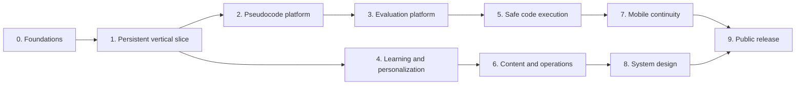

# Implementation Roadmap

This roadmap is the execution companion to [PRODUCT_PLAN.md](PRODUCT_PLAN.md). It covers the path from the current walking skeleton to the complete product while preserving deployable increments.

## How to use this roadmap

- Work in order within a phase unless a dependency explicitly allows parallel work.
- Turn each numbered work package into one epic or a small set of GitHub issues.
- Every issue must name acceptance criteria, tests, telemetry, security impact, and rollout plan.
- Merge incomplete user journeys behind server-controlled feature flags.
- Advance phases only when the exit criteria are evidenced, not merely when code is merged.
- Keep the [requirements matrix](REQUIREMENTS_MATRIX.md) updated as scope changes.

## Current implementation status and one-week launch track

This section supplements the roadmap; it does not replace or reorder the phases below.

### Completed or currently implemented

- The responsive practice workspace and current hash-map activity are available.
- Local draft autosave, deterministic rubric evaluation, coding unlock, and TypeScript translation are implemented.
- Persistent practice-session APIs exist for start/resume, revisions, history, evaluation, and completion.
- Phase 2 foundations include AST/static-analysis work, versioned rubric structures, and strategy classification.
- The Phase 3 evaluation boundary now returns job IDs and supports polling and cancellation.
- Evaluation jobs include idempotency, retry accounting, dead-letter state, queue-age metrics, and bounded trace execution.
- The AI gateway boundary includes redaction, timeout, schema validation, deterministic evidence merging, and a disabled-by-default kill switch.
- Learner appeal records, reviewer resolution state, and immutable appeal audit events are represented.
- A reversible PostgreSQL migration and adapter now define durable evaluation jobs, appeals, and audit storage; production route selection is controlled by `EVALUATION_JOB_STORE=postgres`, while worker deployment remains a launch task.
- Phase 4 foundations now include a validated concept graph, interpretable mastery updates, and explainable recommendation selection.
- Phase 5 has a bounded execution request/result contract; selecting and operating a sandbox remains required.
- Phase 6 has content-publication validation and least-privilege administration authorization foundations.
- Phase 7 has an ordered, account-safe offline revision queue foundation.
- Phase 8 has a validated system-design document model.
- Phase 9 has a release-readiness checklist.
- The active implementation branch is `phase-3-evaluation-platform`.

### Launch target

The near-term target is a functional private beta within one week. The beta should provide one smooth, reliable learning loop for the existing activity rather than attempting to complete every future phase:

1. Authenticate or start as a guest.
2. Open the lesson and practice workspace.
3. Save and resume a pseudocode revision across refreshes/devices for signed-in users.
4. Submit an evaluation and poll its status.
5. Review deterministic, evidence-linked findings.
6. Complete the pseudocode activity or unlock the coding workspace.

AI evaluation, broad content expansion, social features, native mobile apps, and system-design learning remain future work. Keep them disabled or out of the beta path until their operational and quality requirements are met.

### Required next work, in order

**Launch blocker 1: make evaluation jobs durable.** Replace the process-local job map with a managed database-backed job table or hosted queue plus a worker. Preserve the existing job contract, idempotency key, retry limit, dead-letter state, cancellation behavior, and polling route. Add a migration, worker health check, and a failure-recovery test.

**Launch blocker 2: productionize the learner path.** Configure hosted PostgreSQL, authentication/session secrets, production environment variables, migrations, seed content, and a deployment target. Verify object ownership, guest behavior, revision conflicts, and resume behavior in staging.

**Launch blocker 3: make the UI resilient.** Connect the workspace to the API job lifecycle, show saving/saved/conflict states, show evaluation progress, handle retryable failures, and prevent duplicate submissions. Keep the deterministic evaluator as the beta fallback.

**Launch blocker 4: add minimum operations.** Add structured error tracking, request correlation IDs, latency and queue-age metrics, rate limiting, database backups, health checks, and an operator runbook for failed jobs and rollback.

**Launch blocker 5: validate the private beta.** Run clean-database migrations, build/type checks, API tests, accessibility checks, browser smoke tests, backup/restore, queue failure injection, and a small invited-user test. Record defects and prioritize only issues that affect data safety, correctness, accessibility, or the core learning loop.

### One-week execution sequence

- **Day 1:** Freeze the beta scope; configure hosting, domain, environment variables, authentication, and managed PostgreSQL.
- **Day 2:** Implement the durable evaluation job store/worker and migrate the current in-memory contract.
- **Day 3:** Connect the workspace to persistence and job polling; handle conflicts, retries, cancellation, and duplicate submits.
- **Day 4:** Add monitoring, rate limits, backups, health checks, seed data, and rollback instructions.
- **Day 5:** Run staging migrations, end-to-end browser tests, accessibility checks, and failure drills.
- **Days 6–7:** Invite a small beta group, monitor queue age/errors/latency, fix launch blockers, and avoid adding new roadmap scope.

### Rules for efficient continuation

- Work in small, mergeable slices on `phase-3-evaluation-platform` and keep `main` deployable.
- Treat the existing API contracts as the compatibility boundary while replacing local adapters with managed services.
- Prefer managed infrastructure and the deterministic evaluator for the first release.
- Do not expose AI, code execution, or unfinished features until their feature flags, budgets, safety checks, and rollback path exist.
- Every change must include its failure behavior, authorization impact, test coverage, and rollout/rollback note.
- Measure before optimizing: track evaluation latency, queue age, failure rate, duplicate submissions, save conflicts, and user completion rate.
- After the private beta is stable, return to the numbered roadmap phases and advance only when their stated exit criteria have evidence.

## Current baseline

Completed in commit `a3a4272`:

- Responsive Next.js practice workspace.
- One original hash-map lesson and problem.
- Text and lightweight semantic-block composition.
- Local browser autosave.
- Deterministic rubric checks and coding unlock.
- TypeScript translation workspace.
- Unit tests, CI, Docker image, health endpoint, and Vercel deployment.

Important limitations:

- Guest data exists only in one browser.
- Blocks are newline templates, not a typed AST or Blockly workspace.
- The evaluator is keyword-based and supports one problem.
- Code is not executed.
- Navigation, notifications, progress, and coding checks are demonstrative UI.
- There is no identity, database, API domain layer, content workflow, telemetry, or admin tool.

## Delivery map

## Phase 0: Engineering and product foundations

**Outcome:** The repository can support multiple apps, shared contracts, persistent data, secure delivery, and observable releases.

### 0.1 Record product decisions

- Confirm initial audience, age eligibility, supported regions, and retention assumptions.
- Choose the first two coding languages.
- Assign owners for product, content rights, security, privacy, evaluator quality, and operations.
- Define evaluator quality thresholds with expert reviewers.
- Create ADRs for identity, database/migrations, queue, AI, sandbox, hosting/IaC, telemetry, and notifications.

**Acceptance:** Each required decision in `PRODUCT_PLAN.md` section 25 has an owner, decision, evidence, and review date.

### 0.2 Establish monorepo boundaries

- Add workspace tooling for `apps/*` and `packages/*`.
- Create `packages/domain` and `packages/contracts` when the persistent attempt work begins.
- Add shared formatting, linting, TypeScript, test, and dependency policies.
- Add conventional pull-request and issue templates.

**Tests:** Clean install, lint, typecheck, unit tests, and build work from repository root.

### 0.3 Harden CI and repository policy

- Add dependency review, Gitleaks, CodeQL, license checks, and Dependabot/Renovate.
- Generate an SBOM for release artifacts.
- Add branch protection requiring CI and review.
- Add `SECURITY.md`, `CODEOWNERS`, contribution guide, and supported-version policy.
- Pin third-party actions to immutable commits for production workflows.

**Acceptance:** A seeded test secret and known vulnerable fixture fail only the dedicated security test workflow, then are removed before merge.

### 0.4 Provision reproducible environments

- Choose Terraform or Bicep and create development/staging environment composition.
- Provision runtime, PostgreSQL, object storage, queue, telemetry, budgets, and managed secret storage.
- Configure GitHub OIDC rather than repository cloud keys.
- Add preview, staging, and rollback workflows.

**Acceptance:** A new staging environment can be created from an empty account/project and destroyed using reviewed automation.

### 0.5 Add observability and feature flags

- Generate and propagate correlation IDs.
- Add structured logs with deny-by-default sensitive fields.
- Instrument web vitals, API latency/errors, queue age, and evaluation timing.
- Add server-controlled flags for AI evaluation, code execution, notifications, and new content.

**Exit criteria**

- Root-level build and security gates pass.
- Staging is reproducible and has no long-lived CI credential.
- A request can be traced through web/API without logging answer content.
- Production work remains blocked until the known framework advisories are resolved or formally risk-accepted.

## Phase 1: Persistent vertical slice

**Outcome:** A guest or signed-in learner can complete, save, resume, and review the current hash-map activity across devices.

### 1.1 Define domain contracts

Create schemas and domain types for:

- `User`, `UserPreference`, and `GuestIdentity`.
- `ContentItem`, `ContentVersion`, and `RubricVersion`.
- `PracticeSession`, `Attempt`, and `PseudocodeRevision`.
- `Evaluation` and `EvaluationFinding`.

Move evaluator rules out of the React-facing module into a versioned rubric implementation.

### 1.2 Add PostgreSQL and migrations

- Add migrations for the Phase 1 entities.
- Add synthetic seed content for the existing lesson/problem.
- Add repository interfaces and transactional application services.
- Store timestamps in UTC and revision numbers for optimistic concurrency.

**Tests:** Repository integration tests against an ephemeral PostgreSQL instance.

### 1.3 Add identity and guest upgrade

- Implement managed email/OAuth sign-in.
- Issue secure, HTTP-only, same-site sessions.
- Keep guest mode available.
- Define deterministic guest-to-account merge behavior for drafts and history.
- Add session listing and revocation.

**Security tests:** CSRF, session fixation, object ownership, logout, revoked session, and guest merge collision.

### 1.4 Implement attempt APIs

- Start/resume a practice session.
- Append pseudocode revisions with idempotency and optimistic concurrency.
- Evaluate a revision.
- Mark pseudocode-only completion or coding unlock.
- Fetch history and exact resume state.

**Acceptance:** Refreshing or signing in on another device resumes the same revision and stage without duplicate attempts.

### 1.5 Replace local-only autosave

- Keep local storage as an offline buffer.
- Debounce server saves and show saving/saved/conflict states.
- Retry transient failures with idempotency keys.
- Present an explicit conflict choice when revisions diverge.

### 1.6 Add first complete end-to-end tests

Cover guest start, autosave, sign-up upgrade, resume, failed evaluation, passing evaluation, pseudocode-only completion, and coding unlock.

**Exit criteria**

- The current journey works in staging with persistent, versioned data.
- Authorization tests prove users cannot access another user’s attempt.
- Backup and restore of Phase 1 data is rehearsed.
- Accessibility checks pass for keyboard, screen reader announcements, contrast, and 320px reflow.

## Phase 2: Pseudocode platform

**Outcome:** Text and accessible blocks share a typed, versioned representation and support multiple algorithm patterns.

### 2.1 Specify AST v1

- Define node and expression schemas, stable node IDs, source spans, and schema version.
- Support declarations, assignments, conditions, loops, functions, returns, collection operations, assertions, complexity, and intent nodes.
- Add fixtures for valid, partial, ambiguous, and malformed submissions.

### 2.2 Build structured-English parser

- Start with a constrained grammar for authored patterns.
- Preserve unparsed text as intent nodes.
- Produce useful diagnostics for undefined state, ambiguous references, indentation, and missing branches.
- Add formatter and parse-format-parse round-trip tests.

### 2.3 Introduce Blockly behind an adapter

- Use Blockly for interaction, not as the domain model.
- Convert Blockly workspace state to and from AST v1.
- Synchronize block and text modes through the AST.
- Provide a fully keyboard-operable text equivalent and focus restoration.

### 2.4 Add static analysis

- Build symbol tables, basic control-flow graphs, return-path checks, mutation/use checks, and bounded operation-cost inference.
- Emit findings tied to node IDs and source spans.
- Keep analysis deterministic and independently testable.

### 2.5 Add AST migration framework

- Store original source plus AST version.
- Implement forward migrations and fixture-based compatibility tests.
- Never reinterpret a historical evaluation without preserving its original version.

### 2.6 Expand authored content

Create 10 benchmark activities first, then 40-60 alpha activities spanning arrays, hashing, two pointers, windows, stacks/queues, recursion, trees, graphs, and introductory dynamic programming.

Each activity requires original content, learning objectives, prerequisites, accepted strategies, semantic requirements, counterexamples, complexity, misconception labels, hints, and provenance approval.

**Exit criteria**

- Text/block round trips preserve meaning for all supported nodes.
- Unsupported text survives as intent nodes without data loss.
- Keyboard-only and screen-reader workflows complete an activity.
- AST/property tests and migration fixtures pass.

## Phase 3: Evaluation platform

**Outcome:** Evaluation is evidence-based, measurable, appealable, and reliable across authored strategy families.

### 3.1 Generalize deterministic rubrics

- Define a rubric schema for critical/optional checks, accepted strategies, evidence rules, counterexamples, hints, and complexity bounds.
- Build a strategy classifier from AST/static evidence.
- Add trace execution over authored concrete cases with strict resource limits.

### 3.2 Build the evaluation job pipeline

- Queue evaluation requests and return job IDs.
- Make jobs idempotent by revision/rubric/evaluator version.
- Add retries, dead-letter handling, queue-age metrics, and cancellation.
- Stream or poll progress without holding HTTP requests open.

### 3.3 Add an AI gateway

- Define a provider-neutral interface and schema-validated result.
- Redact likely personal data and credentials before requests.
- Isolate instructions from untrusted problem and learner text.
- Add token/time/cost budgets, timeout, retry, and circuit breaker.
- Persist model/prompt/schema versions and evidence, not hidden reasoning.
- Provide deterministic fallback and a global kill switch.

### 3.4 Merge evidence conservatively

- Deterministic contradictions override model approval.
- Every actionable AI claim requires a valid source span or node ID.
- Low-confidence or conflicting results do not hard-lock the learner.
- Explain unlock decisions by rubric dimension.

### 3.5 Add appeals and expert review

- Let learners dispute a finding and add context.
- Run a distinct second-pass policy.
- Add reviewer queue, override reason, and immutable audit event.
- Feed resolved disputes into evaluator quality analysis with consent/redaction.

### 3.6 Establish the quality program

- Build expert-labeled gold submissions covering valid alternatives, partial answers, subtle failures, adversarial instructions, and varied writing styles.
- Measure critical-error recall, false acceptance/rejection, expert agreement, appeal reversal, latency, and cost.
- Run the gold suite on every rubric, prompt, parser, and model change.

**Exit criteria**

- Expert-approved thresholds are met across writing styles.
- Deterministic fallback completes the core journey during provider outage.
- Appeals and kill switch work in staging.
- Cost and latency budgets alert before exhaustion.

## Phase 4: Learning, mastery, and personalization

**Outcome:** The product teaches a curriculum, tracks interpretable mastery, and recommends the next useful activity.

### 4.1 Build the concept graph

- Add concepts, prerequisite edges, objectives, and activity mappings.
- Validate graph cycles, unreachable concepts, and missing prerequisites in CI.
- Create the first curriculum path and review cards.

### 4.2 Add onboarding and diagnostic

- Capture goal, timeline, experience, language, availability, accessibility, timezone, and notification preference.
- Make diagnostic optional.
- Explain and allow editing of the generated plan.

### 4.3 Implement mastery v1

- Use an interpretable weighted score from recency, hints, rubric dimensions, transfer, complexity, code result, and confidence calibration.
- Store each evidence event and resulting score version.
- Show why mastery changed.

### 4.4 Implement spaced review

- Schedule review by concept evidence and elapsed time.
- Support complete, snooze, and reschedule.
- Ensure a missed day does not punish or reset progress.

### 4.5 Implement recommendation v1

Score candidates using review due, prerequisites, weakness match, goal relevance, challenge, diversity, repetition, and overload. Persist factors, alternatives, chosen activity, explanation, and outcome.

### 4.6 Build learner surfaces

- Daily home with continue, recommendation reason, reviews, goal progress, and concept map.
- History with revisions and evaluation evidence.
- Notes, bookmarks, reflections, and confidence.
- Controls for disabling personalization and changing goals.

**Exit criteria**

- Recommendation choices are reproducible from stored factors.
- Users can override recommendations and understand why they were made.
- Mastery changes are covered by deterministic tests.
- Transfer-problem outcomes improve in a limited pilot.

## Phase 5: Safe coding workspace

**Outcome:** Learners can translate an approved plan into executable code without exposing the application platform.

### 5.1 Select and threat-model sandbox provider

Validate language support, isolation, network policy, regional processing, retention, quotas, pricing, incident history, and deletion behavior. Start with TypeScript and Python unless user research changes the decision.

### 5.2 Define execution contracts

- Submission, language/runtime version, test manifest, result, resource usage, and failure classes.
- Separate public and hidden tests.
- Limit source size, output, runs, concurrency, CPU, memory, processes, and wall time.

### 5.3 Build asynchronous execution

- Queue submissions and call the sandbox from isolated workers.
- Give sandbox jobs no application credentials or production network path.
- Sanitize compiler/runtime output.
- Add per-user/IP quotas, abuse detection, cancellation, and kill switch.

### 5.4 Complete the editor experience

- Use a proven code editor component.
- Show approved pseudocode beside code and map AST nodes to code regions.
- Add formatting, console, public test results, and accessible status announcements.
- Explain failing input classes without exposing hidden tests.

### 5.5 Compare plan and implementation

Use structural and behavioral signals to highlight divergence between the approved plan and code. Treat this as feedback, not an opaque correctness gate.

**Exit criteria**

- Independent isolation review finds no route to application credentials or data.
- Resource-limit and malicious-code suites pass.
- Provider outage degrades gracefully without losing submissions.
- Successful translation becomes mastery evidence.

## Phase 6: Content operations, administration, and support

**Outcome:** Authorized staff can safely create, review, publish, monitor, and correct product content and evaluations.

### 6.1 Build content authoring workflow

- Draft, preview, review, publish, deprecate, and rollback immutable versions.
- Validate problem examples, tests, rubrics, hints, AST fixtures, and provenance.
- Require subject-matter, editorial, and rights approval.

### 6.2 Add administration roles

Use least-privilege roles for content author, reviewer, rights reviewer, evaluator reviewer, support, privacy operator, and administrator. Avoid unrestricted impersonation; provide read-only diagnostic views.

### 6.3 Build operations queues

- Appeals and low-confidence evaluations.
- Content validation failures and takedowns.
- Failed exports/deletions and notification deliveries.
- Abuse/rate-limit investigations with minimized data.

### 6.4 Add audit and feature controls

- Immutable privileged-action events.
- Feature flags and emergency kill switches.
- Evaluation replay against explicit versions without changing history.

### 6.5 Add support and legal workflows

- Security reporting and incident intake.
- Content notice/takedown process.
- Privacy access, correction, export, and deletion requests.
- Public terms, privacy notice, accessibility statement, and model-processing disclosure before GA.

**Exit criteria**

- A bad content version can be rolled back without a code deployment.
- Every privileged action is attributable and reviewable.
- Takedown, export, deletion, and leaked-credential exercises meet runbook targets.

## Phase 7: Mobile continuity and notifications

**Outcome:** The responsive web app works as an installable PWA with reliable resume, offline-safe edits, and respectful reminders.

### 7.1 Add PWA foundation

- Manifest, icons, install behavior, update strategy, and safe caching.
- Cache only public content and the learner’s explicitly selected material.
- Never cache session credentials or sensitive API responses in a shared cache.

### 7.2 Add offline-safe attempts

- Store an encrypted-at-rest where supported local queue of unsent revisions.
- Reconcile by revision ID and show conflicts explicitly.
- Test clock changes, intermittent connectivity, duplicate delivery, and account switching.

### 7.3 Add notification preferences

- Granular opt-in by channel and purpose.
- Timezone, quiet hours, caps, batching, snooze, and unsubscribe.
- Keep lock-screen payloads free of answer content.

### 7.4 Add in-app and email delivery

- Version templates and localize content.
- Schedule through queue jobs with idempotency.
- Track accepted/delivered/failed/unsubscribed without invasive tracking.
- Rotate invalid provider tokens and delete them at logout/account deletion.

### 7.5 Decide on native apps

Build React Native/Expo clients only if measured PWA limitations justify app-store distribution, stronger push, richer offline behavior, or mobile block interaction.

**Exit criteria**

- Offline edits survive reconnect without silent overwrite.
- Notification consent, quiet hours, caps, snooze, and unsubscribe are verified end to end.
- Accessibility and touch tests pass on supported mobile devices.

## Phase 8: System-design learning

**Outcome:** Learners can practice requirements, estimation, architecture, data flow, failure analysis, and tradeoff communication.

### 8.1 Define system-design document model

Version requirements, assumptions, estimates, APIs/events, data models, components, connections, risks, alternatives, and evolution stages. Use semantic nodes and edges rather than saving only canvas coordinates.

### 8.2 Build the accessible canvas

Use a proven canvas/diagram library with keyboard creation, list/tree alternative, labeled connectors, zoom, pan, grouping, and export. Persist semantic state separately from layout.

### 8.3 Build staged practice flow

1. Clarify functional and non-functional requirements.
2. Record scale assumptions and estimates.
3. Define APIs/events and data model.
4. Build components and labeled flows.
5. Identify bottlenecks, failures, security, privacy, and cost.
6. Compare alternatives and plan evolution.

### 8.4 Build rubric evaluation

Evaluate completeness and coherence rather than one canonical diagram. Combine deterministic checks for missing sections or disconnected flows with evidence-based AI review and appeals.

### 8.5 Author original case studies

Start with URL shortening, chat, notifications, file storage, autocomplete, feed, collaborative editing, ride matching, and metrics ingestion. Each case requires rubric, assumptions, failure prompts, alternatives, and provenance approval.

**Exit criteria**

- A complete case is usable by keyboard and screen reader through the semantic alternative.
- Evaluator feedback cites the learner’s own assumptions/components.
- Expert agreement meets the system-design quality threshold.

## Phase 9: Public-release hardening

**Outcome:** The complete service can safely support a broader audience without undocumented founder intervention.

### 9.1 Privacy and account lifecycle

- Self-service export, correction, deletion, and consent history.
- Tested retention schedules for attempts, code, prompts, logs, notifications, support data, and backups.
- Age eligibility and regional processing enforced.

### 9.2 Reliability and recovery

- Define SLOs and error budgets from staging/pilot evidence.
- Add user-impact alerts, dashboards, and synthetic journeys.
- Test backup restore, queue recovery, provider outage, regional failure, and rollback.

### 9.3 Security and abuse readiness

- Independent application, authorization, and sandbox review.
- WAF/rate limits, bot controls, quotas, cost alarms, dependency/container/IaC scanning.
- Incident response and vulnerability disclosure exercises.

### 9.4 Release governance

- Protected production environment and approvals.
- Immutable artifacts, provenance, SBOM, migration plan, content manifest, and release record.
- Canary/blue-green rollout with measurable rollback criteria.

### 9.5 Public documentation

Publish support contacts, status communication, terms, privacy, accessibility, security, content rights contact, and known limitations.

**Exit criteria**

All gates in `PRODUCT_PLAN.md` section 26 pass with linked evidence. Exceptions require an owner, mitigation, written risk acceptance, and expiration date.

## Cross-cutting definition of done

Every production feature includes:

- Domain and API contract review.
- Authorization and abuse-case analysis.
- Unit tests plus the appropriate integration/contract/E2E tests.
- Keyboard, screen-reader, reflow, and reduced-motion checks for UI work.
- Structured telemetry with redaction and an operational dashboard.
- Feature flag or rollback path for risky behavior.
- Data retention and deletion behavior.
- Documentation and requirement-matrix update.
- No unresolved critical/high exploitable vulnerability.

## Recommended first 12 issues

1. Record ADR template and assign required product/security owners.
2. Add root workspace scripts and shared TypeScript/lint/test configuration.
3. Add Gitleaks, CodeQL, dependency review, and dependency update automation.
4. Define Phase 1 contracts for content, sessions, attempts, revisions, and evaluations.
5. Select PostgreSQL provider/migration tool and add local ephemeral database tests.
6. Migrate the current lesson/problem into versioned seed content.
7. Implement append-only attempt/revision persistence.
8. Add secure guest identity and session APIs.
9. Replace local-only autosave with offline-buffered server autosave.
10. Persist deterministic evaluations with rubric/evaluator versions.
11. Add resume/history API and cross-device UI.
12. Add the persistent-journey E2E suite and staging restore rehearsal.

Do not begin AI evaluation or code execution before issues 1-12 establish identity, persistence, authorization, observability, and versioning.
