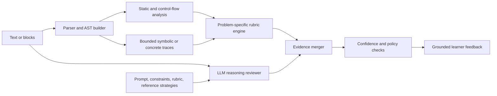
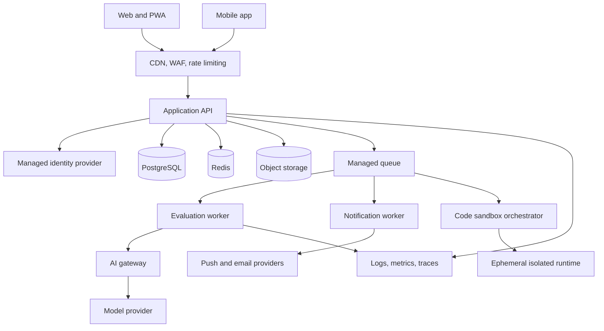

# Pseudocode-First Interview Learning Platform

## 1. Executive summary

Build a cross-platform learning application that helps users master data structures, algorithms, problem-solving patterns, and system design without making code syntax the first obstacle.

The core learning loop is:

1. Learn or review a concept.
2. Read an original or licensed practice problem.
3. Describe the approach in structured English or visual pseudocode blocks.
4. Receive deterministic and AI-assisted evaluation of correctness, completeness, complexity, and clarity.
5. Revise the reasoning until it meets a defined quality threshold.
6. Optionally unlock a coding workspace to implement and test the approved plan.
7. Reflect on errors and receive personalized follow-up practice.

The product is not primarily an online judge. Its differentiator is teaching learners to form, communicate, and validate a solution before writing code.

## 2. Product vision and principles

### Vision

Help learners become better problem solvers by making reasoning visible, testable, and improvable.

### Product principles

- **Reasoning before syntax:** evaluation starts with the algorithm and invariants, not compiler output.
- **Explainability over guessing:** learners should understand why feedback was given and be able to challenge it.
- **Progressive freedom:** start with guided blocks, advance to free-form pseudocode, then move to code.
- **Mastery over streaks:** notifications and rewards support deliberate practice rather than anxiety or compulsive use.
- **Difficulty is multidimensional:** distinguish conceptual difficulty, reasoning difficulty, implementation difficulty, and system-design scope.
- **Feedback must be grounded:** evaluators use problem-specific rubrics and testable claims; the AI is not the sole authority.
- **Mobile continuity:** mobile supports learning, pseudocode review, short practice, and notifications; dense coding remains optimized for larger screens.
- **Privacy and security by default:** collect the minimum personal data, never place secrets in clients or source control, and make deletion/export possible.

### Non-goals for the first release

- Competing with general-purpose IDEs.
- Hosting live competitive programming contests.
- Supporting every programming language.
- Automatically importing copyrighted problem libraries.
- Replacing human interviewers or claiming that AI scores predict hiring outcomes.
- Building a social network, marketplace, or public ranking system.

## 3. Target users and jobs to be done

### Primary personas

| Persona | Need | Product response |
|---|---|---|
| Beginner | Learn common patterns without syntax overload | Guided lessons, block pseudocode, hints, examples, concept prerequisites |
| Returning learner | Refresh weak areas efficiently | Diagnostic assessment, adaptive review, spaced repetition |
| Interview candidate | Practice communicating solutions under time pressure | Timed explain-first sessions, complexity checks, coding handoff |
| Experienced engineer | Prepare for system-design discussions | Case studies, requirement clarification, architecture tradeoff rubrics |
| Mobile learner | Continue in short sessions | Review cards, block editing, saved drafts, reminders, offline queue |

### Core jobs

- “Teach me the concepts I am missing before I attempt harder problems.”
- “Tell me whether my approach works before I spend time implementing it.”
- “Help me express an algorithm clearly enough that I can translate it into code.”
- “Show me why my approach fails on a particular class of inputs.”
- “Give me practice at the right difficulty based on evidence, not a static list.”
- “Let me continue a session across desktop and mobile.”
- “Help me practice system-design reasoning and tradeoffs, not memorize diagrams.”

## 4. Learning model

### Knowledge taxonomy

Each learning item is tagged across independent dimensions:

- Domain: arrays, strings, linked lists, stacks, queues, hash maps, trees, graphs, heaps, tries, intervals, matrices, bit operations, math, databases, concurrency, and system design.
- Pattern: two pointers, sliding window, prefix sums, binary search, divide and conquer, backtracking, greedy, dynamic programming, union-find, topological sort, shortest path, traversal, monotonic structures, and sweep line.
- Concept difficulty: prerequisite knowledge required.
- Reasoning difficulty: difficulty deriving the approach and proving it.
- Implementation difficulty: difficulty converting the plan into correct code.
- Communication difficulty: difficulty explaining invariants and tradeoffs.
- System-design scale: component, service, distributed subsystem, or end-to-end architecture.
- Estimated duration and confidence requirement.

Difficulty is stored as a calibrated numeric score internally and displayed as broad levels such as Foundation, Developing, Proficient, and Advanced. Avoid pretending that a single “Easy/Medium/Hard” label fully describes a task.

### Mastery model

Track mastery per user and concept as a probability or score based on:

- Recency and spacing of successful attempts.
- Number and severity of hints used.
- Pseudocode rubric dimensions passed.
- Transfer to new problems using the same concept.
- Ability to identify complexity and edge cases.
- Coding accuracy after an approved plan, when coding is enabled.
- Self-reported confidence compared with observed performance.

For the MVP, use an interpretable weighted model. After sufficient anonymized data and validation, consider Bayesian Knowledge Tracing or Item Response Theory. Do not launch with opaque recommendation ML that cannot be debugged.

### Practice modes

1. **Learn:** short concept lesson, worked example, comprehension checks.
2. **Guided pseudocode:** arrange or fill visual blocks with constrained hints.
3. **Free-form pseudocode:** write structured English using a lightweight grammar.
4. **Pseudocode only:** finish after reasoning evaluation; no implementation required.
5. **Pseudocode then code:** coding workspace unlocks after the reasoning threshold is met.
6. **Code directly:** available as an advanced/user-controlled option, but not the recommended path.
7. **Explain aloud:** record or transcribe a verbal explanation for communication feedback.
8. **System design:** clarify requirements, estimate scale, choose components, draw flows, and discuss tradeoffs.
9. **Review:** revisit mistakes and concepts using spaced repetition.
10. **Diagnostic:** estimate current concept mastery and build an initial study plan.

## 5. Core user experience

### Onboarding

Ask for:

- Goal: interview date, skill building, school, or general practice.
- Experience level and preferred implementation languages.
- Weekly availability and preferred notification windows.
- Accessibility preferences.
- Optional diagnostic assessment.

Generate a transparent first plan. Users can edit the plan, disable personalization, skip diagnostics, and change notification frequency.

### Daily home

The first screen is the working experience, not a marketing page. It should show:

- Continue current session.
- Recommended next activity with a short “Why this?” explanation.
- Concepts due for review.
- Progress toward the current learning goal.
- A compact concept map showing strengths, gaps, and prerequisites.
- Quick access to algorithms, system design, saved notes, and history.

### Problem session

1. Present the prompt, examples, constraints, and expected learning objectives.
2. Ask the learner to restate the problem and identify unknowns.
3. Let the learner explore examples and edge cases.
4. Open the pseudocode workspace in block or text mode.
5. Run evaluation and show findings tied to exact steps or blocks.
6. Let the learner revise, request a graduated hint, or dispute feedback.
7. Once the threshold is met, mark the reasoning complete.
8. In “pseudocode then code” mode, unlock language selection, editor, tests, and execution.
9. End with a reflection: key insight, mistake category, confidence, and follow-up recommendation.

The learner can save and resume at every stage. Moving between text and blocks should preserve semantics whenever the text fits the supported pseudocode grammar.

### Pseudocode workspace

#### Visual block mode

Provide accessible, keyboard-operable blocks for:

- Variables and assignments.
- Conditions and Boolean expressions.
- Loops and iteration over collections.
- Functions, parameters, calls, and returns.
- Collection operations.
- Stack, queue, heap, map, set, tree, and graph operations.
- Recursion and base cases.
- Assertions, invariants, and complexity annotations.
- Natural-language intent blocks for operations not yet formalized.

Blocks should connect based on a typed intermediate representation, not only screen position. Use a proven block editor such as Blockly for interaction, with a product-specific semantic layer and accessible text alternative.

#### Structured English mode

Support flexible statements such as:

```text
Create a map from value to its index.
For each number at index i:
  Let complement be target minus number.
  If complement exists in the map, return its index and i.
  Otherwise store number mapped to i.
Return no result.
```

The editor should identify ambiguous references, undefined state, missing return paths, inconsistent indentation, and operations whose cost may invalidate the target complexity.

#### Intermediate representation

Both modes compile into a versioned pseudocode abstract syntax tree (AST). The AST includes operations, control flow, data structures, annotations, and source spans. This enables:

- Block/text conversion.
- Static analysis and control-flow checks.
- Trace execution against abstract inputs.
- Evaluation linked to source locations.
- Safe migrations as the grammar evolves.
- Analytics based on semantic actions rather than raw text.

Free-form text that cannot be parsed remains valid as an “intent node” and is evaluated with lower confidence; the learner is never forced to fight a rigid parser to express a sound idea.

### Feedback design

Feedback is layered rather than shown as a binary verdict:

- Approach classification: recognized pattern and strategy.
- Correctness: whether the algorithm meets the functional contract.
- Completeness: initialization, updates, termination, and return paths.
- Edge cases: specific missing input classes.
- Complexity: expected time and space with supporting reasoning.
- Clarity: ambiguous references or steps too broad to implement.
- Invariants: what must remain true and whether the plan preserves it.
- Confidence: evaluator confidence and why it may be uncertain.

Use graduated help:

1. Ask a diagnostic question.
2. Point to the affected step.
3. Name the missing concept.
4. Provide a small counterexample.
5. Reveal a structural hint.
6. Show a complete reference approach only after explicit confirmation.

Never silently rewrite the learner's answer into a model solution.

## 6. Pseudocode evaluation system

### Evaluation pipeline



### Deterministic evaluation

Use deterministic checks wherever practical:

- AST validity and data-flow checks.
- Missing initialization, termination, or return paths.
- Trace comparison on curated normal and edge cases.
- Operation-count rules for obvious complexity violations.
- Required rubric elements for known solution families.
- Contradictions between claimed and inferred complexity.

For each problem, authors define:

- Learning objectives and prerequisites.
- Accepted strategy families.
- Required semantic steps and acceptable variants.
- Forbidden assumptions.
- Edge-case families and counterexamples.
- Expected complexity ranges.
- Misconception patterns and hint ladder.
- Reference pseudocode that is not exposed by default.

### AI-assisted evaluation

The language model reviews semantic intent, ambiguous English, explanation quality, alternate valid strategies, and tradeoffs. It receives only the content needed for the current evaluation and returns schema-validated JSON containing claims, evidence spans, confidence, and proposed feedback.

Controls:

- Never let the model alone determine unlock status when deterministic evidence contradicts it.
- Require source-span evidence for every actionable critique.
- Use low temperature and a versioned evaluator prompt.
- Validate output against a strict schema.
- Defend against prompt injection in problem and learner content by treating both as untrusted data.
- Redact personal data and secrets before model calls.
- Set request timeouts, token limits, retries, and per-user budgets.
- Provide a non-AI fallback based on static checks and authored rubrics.
- Store evaluator version and rubric version with each result.
- Sample disputed and low-confidence results for human review with consent and redaction.

### Unlock policy

The coding stage unlocks when:

- All critical correctness checks pass.
- No known counterexample breaks the proposed algorithm.
- Initialization, termination, and return behavior are represented.
- Complexity is appropriate for the problem constraints or the learner explicitly chooses an educational brute-force path.
- Evaluator confidence meets the configured threshold.

Users can appeal an evaluation. An appeal triggers a second evaluation path and presents disagreement transparently. Educators or content reviewers can override results. The product should avoid trapping a learner behind a fallible AI gate.

### Evaluation quality program

Create a gold dataset of diverse pseudocode submissions containing correct alternatives, partial answers, subtle errors, ambiguity, adversarial text, and varying English fluency. Before release, measure:

- Critical-error recall.
- False rejection rate for correct approaches.
- False acceptance rate for incorrect approaches.
- Agreement with expert reviewers by rubric dimension.
- Performance across writing styles and accessibility needs.
- Latency and cost per evaluation.
- Appeal and override rate in production.

Block release if critical-error recall or false rejection exceeds agreed thresholds. Initial targets should be set after a blinded expert baseline, rather than invented without evidence.

## 7. Coding workspace

The coding workspace is secondary but complete:

- Start with TypeScript, Python, Java, and C++ based on demand and sandbox support.
- Show the approved pseudocode beside the editor.
- Let users map pseudocode steps to code regions.
- Provide syntax highlighting, formatting, test execution, and console output.
- Run untrusted code in isolated, ephemeral sandboxes with strict CPU, memory, process, network, filesystem, and wall-time limits.
- Keep public and hidden tests separate; explain failing input classes without exposing every hidden case.
- Compare code behavior with the approved plan and identify implementation divergence.
- Do not allow arbitrary package installation or outbound network access in the initial release.

Use a proven sandbox provider for MVP or isolate workers with hardened microVM/container technology. Do not execute learner code in API processes or on shared hosts without a strong isolation boundary.

## 8. Concept and system-design curriculum

### Algorithm curriculum

Organize content as a prerequisite graph rather than a flat problem list:

- Foundations: complexity, arrays, strings, pointers, hashing, recursion.
- Linear structures: linked lists, stacks, queues, deques.
- Search and ordering: sorting, binary search, selection.
- Trees: traversals, BSTs, heaps, tries, balanced-tree concepts.
- Graphs: representation, BFS/DFS, DAGs, union-find, shortest paths, MST.
- Problem-solving patterns: windows, prefix sums, intervals, monotonic structures, greedy, backtracking.
- Dynamic programming: state design, transitions, dimensions, optimization.
- Advanced topics: bit manipulation, computational geometry basics, concurrency patterns, and domain-specific extensions.

Each concept includes a concise lesson, visual trace, vocabulary, prerequisites, common misconceptions, worked pseudocode, guided exercises, transfer problems, and review prompts.

### System-design curriculum

Cover both product architecture and interview communication:

- Requirement clarification and scope control.
- Functional and non-functional requirements.
- Capacity estimation and assumptions.
- API and event contract design.
- Data modeling, indexing, partitioning, and consistency.
- Caching and invalidation.
- Load balancing, replication, and failover.
- Queues, streams, asynchronous workflows, and backpressure.
- Search, feeds, rate limiting, notification systems, and media delivery.
- Observability, security, privacy, reliability, and cost.
- Multi-region design, disaster recovery, and data residency.
- Tradeoff communication and evolution from MVP to scale.

System-design practice should use an interactive canvas with standard components and labeled flows. Evaluation follows a rubric, not a single canonical diagram:

- Clarified requirements.
- Justified assumptions and estimates.
- Coherent APIs and data model.
- Correct component responsibilities and data flow.
- Identification of bottlenecks and failure modes.
- Security, privacy, and abuse controls.
- Tradeoffs, alternatives, and scaling path.

Provide case studies such as URL shortening, chat, notifications, file storage, search autocomplete, news feed, collaborative editing, ride matching, and metrics ingestion. All cases and diagrams must be original or licensed.

## 9. Personalization and continuous improvement

### Recommendation policy

Choose the next activity using:

- Goal and available time.
- Concept mastery and prerequisite gaps.
- Items due for spaced review.
- Recent error categories.
- Difficulty calibration and frustration signals.
- Content diversity to avoid repetitive sessions.
- User preferences and explicit skips.

Every recommendation includes an explanation such as “Your last two graph attempts missed visited-state handling, and this 12-minute guided exercise isolates that skill.” Users can choose “too easy,” “too hard,” “not relevant,” or “show another.”

### Initial adaptive algorithm

Use a rules-based scorer for candidates:

```text
priority = review_due
         + prerequisite_value
         + weakness_match
         + goal_relevance
         + desired_challenge
         + content_diversity
         - recent_repetition
         - predicted_overload
```

Log the factors, selected item, alternatives, and outcome. This makes recommendations inspectable and provides training data for later improvements without committing prematurely to complex ML.

### Continuous product learning

- Instrument funnel events from lesson start through pseudocode approval and optional code completion.
- Track learning outcomes, not just session duration.
- Run opt-in experiments with guardrails for learning quality and notification burden.
- Maintain evaluator and recommender model cards.
- Review appeals, abandonments, hints, and feedback ratings for content defects.
- Version content, rubrics, prompts, and mastery logic so historical results remain interpretable.

## 10. Mobile and notifications

### Cross-platform strategy

Start with a responsive web application and installable PWA for validation. Add React Native applications when push reliability, offline behavior, app-store distribution, or mobile block interactions justify the cost. Share domain types, API clients, design tokens, and validation logic; do not force web UI components into native interfaces.

### Mobile capabilities

- Continue lessons and saved attempts.
- Arrange blocks and edit short structured-English solutions.
- Review concepts, traces, feedback, and flashcards.
- Receive and manage notifications.
- Cache current plan and selected lessons for intermittent connectivity.
- Queue safe local edits and resolve version conflicts explicitly.

### Notification policy

Support push, email, and in-app notifications with granular opt-in controls:

- Scheduled practice reminder.
- Spaced-review item due.
- Saved session follow-up.
- Weekly progress summary.
- Optional goal-risk warning before an interview date.

Use quiet hours, timezone-aware delivery, frequency caps, batching, one-tap snooze, and one-tap unsubscribe. Never send sensitive answer content in notification payloads or lock-screen text. Store provider tokens encrypted, rotate invalid tokens, and delete them on logout/account deletion.

## 11. Functional requirements

### Identity and account

- Email magic link and major OAuth providers.
- Optional guest mode with later account upgrade.
- Profile, goals, preferences, accessibility, locale, and timezone.
- Session/device management and revocation.
- Data export and account deletion.

### Content authoring

- Versioned lessons, problems, examples, rubrics, hints, solutions, and tags.
- Draft, review, publish, deprecate, and rollback workflow.
- Preview for text, blocks, tests, and system-design canvases.
- Subject-matter, editorial, and rights-review approval with immutable audit history.
- License/provenance metadata for every content item: author, source, source URL when applicable, copyright holder, license identifier and version, attribution text, territorial or usage restrictions, evidence of permission, reviewer, approval date, and expiration date when applicable.
- Publication is blocked until provenance is verified and a rights reviewer approves the license for the intended commercial or non-commercial use.
- Content-name checks flag third-party brands and problem identifiers for review without blocking private learner notes or legitimate nominative references.
- A documented notice-and-takedown workflow pauses disputed content, preserves evidence, notifies the owner, tracks response deadlines, and supports corrected republishing.
- Initially accept only original commissioned content and licenses approved by counsel or the designated rights owner; do not assume that publicly visible content is reusable.

### Learning and attempts

- Plans, modules, prerequisites, recommendations, and due reviews.
- Autosaved, versioned attempts with resume support.
- Pseudocode text, AST, blocks, evaluator results, and feedback history.
- Coding submissions and sandbox outcomes when enabled.
- Notes, bookmarks, reflections, and confidence.
- Progress dashboard and concept mastery history.

### Administration and support

- User/content search with least-privilege roles.
- Evaluation replay by version.
- Appeal and moderation queue.
- Feature flags and kill switches for AI evaluation, code execution, and notifications.
- Audit logs for privileged actions.
- Support-safe impersonation alternative using read-only diagnostic views; avoid unrestricted account impersonation.

## 12. Accessibility and internationalization

- Meet WCAG 2.2 AA for web and equivalent native guidance.
- Make the block editor fully keyboard navigable with a synchronized text representation.
- Preserve logical focus order and announce evaluation updates.
- Do not use color alone for mastery, correctness, or difficulty.
- Support reduced motion, high contrast, zoom, and screen readers.
- Test touch targets and text reflow on mobile.
- Keep learning content separate from UI strings for localization.
- Evaluate AI feedback for plain language and non-native English fairness.

## 13. Recommended architecture

### Initial stack

This is a recommended default, to be confirmed during technical discovery:

- Web: Next.js with TypeScript and a shared component system.
- Mobile later: React Native with Expo.
- Block editor: Blockly behind a product-owned adapter.
- API: modular TypeScript service using NestJS or a thin Next.js backend initially, with clear domain boundaries.
- Database: PostgreSQL.
- Cache and rate limits: managed Redis.
- Object storage: S3-compatible managed storage for recordings and exports.
- Async work: managed queue for evaluations, notifications, analytics, and code jobs.
- Search: PostgreSQL full-text search first; dedicated search only when justified.
- AI gateway: server-side provider adapter supporting structured output, redaction, budgets, and provider portability.
- Code execution: external sandbox API first, then isolated worker pool if economics require it.
- Observability: OpenTelemetry with managed logs, metrics, traces, and error reporting.
- Infrastructure: Terraform or equivalent IaC, one approach per environment.
- Hosting: managed container or serverless platform in one region for MVP, with CDN/WAF at the edge.

Prefer a modular monolith for the API at launch. Separate deployable services only for code execution and asynchronous workers, which have distinct security and scaling requirements.

### Logical architecture



### Domain modules

- Identity and preferences.
- Content catalog and authoring.
- Curriculum graph and mastery.
- Practice sessions and attempts.
- Pseudocode parsing and AST.
- Evaluation and appeals.
- Recommendations and plans.
- Code execution.
- Notifications.
- Billing/entitlements if monetization is later approved.
- Administration, audit, and support.

### Multi-environment layout

- Local: containerized dependencies or managed development services; seeded synthetic content.
- Preview: isolated ephemeral web/API environments per pull request with no production data.
- Development: shared integration environment.
- Staging: production-like topology, synthetic users, and release-candidate content.
- Production: separately permissioned account/project/subscription with protected deployment approvals.

Never share production credentials or user data with development, preview, CI pull-request jobs, or model evaluation datasets.

## 14. Data model outline

Core entities:

| Entity | Purpose |
|---|---|
| User | Identity reference and account lifecycle state |
| UserPreference | Goals, locale, timezone, accessibility, notifications |
| Concept | Versioned concept in the prerequisite graph |
| ConceptEdge | Prerequisite or related-concept relationship |
| ContentItem | Lesson, exercise, problem, system-design case, or review item |
| ContentVersion | Immutable authored content revision and provenance |
| RubricVersion | Accepted strategies, checks, hints, and evaluator configuration |
| LearningPlan | User goal, schedule, and ordered/adaptive activities |
| PracticeSession | Resumable learning session and selected mode |
| Attempt | Versioned response, status, and outcome |
| PseudocodeDocument | Source text/blocks, AST version, and revision |
| Evaluation | Deterministic and AI findings with versions and confidence |
| Appeal | User dispute, second review, and resolution |
| CodeSubmission | Language, source reference, and sandbox result |
| MasteryState | Per-user concept score and evidence summary |
| Recommendation | Candidate factors, chosen activity, and explanation |
| ReviewSchedule | Spaced repetition due date and interval state |
| Device | Push token reference and notification capabilities |
| Notification | Template, channel, schedule, delivery, and consent state |
| AuditEvent | Privileged action history |

Store large recordings and exports in object storage, not the relational database. Separate direct identifiers from learning analytics where practical. Define retention and deletion behavior for every entity before launch.

## 15. API outline

Use versioned JSON APIs or a typed RPC layer with explicit authorization. Representative endpoints:

```text
GET    /v1/me
PATCH  /v1/me/preferences
POST   /v1/diagnostics
GET    /v1/plans/current
POST   /v1/recommendations/next
GET    /v1/content/{contentId}
POST   /v1/sessions
PATCH  /v1/sessions/{sessionId}
POST   /v1/attempts/{attemptId}/revisions
POST   /v1/attempts/{attemptId}/evaluations
GET    /v1/evaluations/{evaluationId}
POST   /v1/evaluations/{evaluationId}/appeals
POST   /v1/attempts/{attemptId}/unlock-code
POST   /v1/code-submissions
GET    /v1/jobs/{jobId}
GET    /v1/mastery
POST   /v1/devices
DELETE /v1/devices/{deviceId}
POST   /v1/privacy/export
DELETE /v1/account
```

Mutating endpoints use idempotency keys where retries are likely. Autosave uses optimistic concurrency and revision IDs. Long-running evaluations and code runs return job IDs and stream or poll status. Webhooks from external providers require signature verification and replay protection.

## 16. Security, privacy, and secret management

### Threat model priorities

- Untrusted learner code escaping the sandbox.
- Prompt injection or data exfiltration through AI evaluation.
- Cross-user access to attempts, plans, or recordings.
- Abuse of expensive model and code-execution endpoints.
- Content-authoring compromise that changes rubrics or injects scripts.
- Push-token, OAuth-token, or API-key exposure.
- Supply-chain compromise in web, mobile, or worker dependencies.
- Scraping, spam, automated account creation, and denial of wallet.

### Required controls

- Central authorization policy with deny-by-default object ownership checks.
- Managed identity/OIDC for service-to-service and CI cloud access; avoid long-lived cloud keys.
- Secrets only in a managed secret store, injected at runtime and rotated.
- No secrets in Git, application bundles, mobile binaries, logs, analytics, screenshots, fixtures, or error messages.
- Pre-commit and CI secret scanning, dependency scanning, static analysis, container scanning, and IaC scanning.
- Protected main branch, required reviews, signed/provenance-aware builds, and least-privilege deployment roles.
- Encryption in transit and at rest, plus field-level protection for sensitive provider tokens where needed.
- Strong content security policy, secure cookies, CSRF protection, input validation, output encoding, and safe Markdown rendering.
- Rate limits and quotas by IP, account, endpoint, and cost category.
- Separate code-execution network and account boundary with no production database access.
- Tamper-evident audit events for content publishing, evaluator configuration, support access, and security changes.
- Backups with restore tests and documented retention.
- Incident response, vulnerability disclosure, breach notification, and credential-rotation runbooks.

### Repository hygiene

Before the first application code is merged, add:

- `.gitignore` covering local environment files, build output, IDE state, certificates, and generated credentials.
- `.env.example` containing names and safe placeholders only.
- Secret-scanner configuration and CI blocking rules.
- Dependency update automation.
- `SECURITY.md` with reporting and supported-version policy.
- `CODEOWNERS` for security-sensitive and infrastructure paths.

If a secret is ever committed, removing the file is insufficient. Revoke/rotate it immediately, assess access, then clean history only through an approved incident process.

### GitHub source-of-truth policy

GitHub is the source of truth for application code, tests, database migrations, IaC, CI workflows, operational runbooks, architecture decisions, schemas, safe local-development configuration, and sanitized synthetic fixtures. Branch protection requires pull requests, passing checks, and review by the relevant code owner.

Do not interpret “commit everything” as permission to commit secrets, production data, personal data, provider tokens, private keys, raw user submissions, recordings, database snapshots, restricted licensed content, unpublished evaluator gold answers, or environment state. Those belong in access-controlled systems with explicit retention and audit policies. The repository contains schemas, import/export tooling, content manifests, and hashes or immutable version references so deployed state remains reproducible without exposing protected material.

Choose the content source of truth during discovery:

- Store original, redistributable seed content and rubrics as reviewed files in Git when public exposure is acceptable.
- Store restricted or rapidly edited production content in the versioned content service, with immutable revisions, approval events, and exportable manifests tied to application releases.
- Never maintain the same editable content as competing sources in both Git and the database.
- Record the content manifest/version in every deployment and support rollback to a prior approved revision.

### Rights and takedown ownership

Before content publishing begins, name a rights owner and legal escalation contact. They maintain the approved-license register, review provenance evidence, process notices, decide whether disputed content stays unavailable, and document resolution. The public product provides a clear rights-contact channel and the operations team has a takedown runbook with response targets.

### Privacy

- Publish a plain-language privacy notice and consent record.
- Collect the minimum data required for learning and operations.
- Make AI processing and human review visible to users.
- Do not train models on user submissions by default.
- Provide export, correction, and deletion workflows.
- Define retention periods for drafts, code, recordings, logs, support data, and backups.
- Conduct a data protection impact assessment before voice capture, minors support, or behavioral personalization at scale.
- Age-gate or exclude minors from the initial release unless legal and safety requirements are deliberately implemented.

## 17. Reliability, observability, and operations

### Initial service objectives

- API availability target: 99.9% monthly after general availability.
- Read API p95 latency: under 400 ms excluding large content media.
- Autosave p95 latency: under 500 ms.
- Evaluation job p95 completion: target under 12 seconds, measured separately by evaluator type.
- Notification scheduling accuracy: 99% within five minutes, excluding provider outages.
- Recovery point objective: 15 minutes for primary data.
- Recovery time objective: 4 hours for MVP, tightened as usage grows.

Treat these as starting hypotheses and revise from production evidence and user expectations.

### Observability

- Structured logs with correlation IDs and automatic redaction.
- Distributed traces across API, queue, evaluation, model, notification, and sandbox calls.
- Metrics for availability, latency, errors, saturation, queue age, model cost, sandbox utilization, and provider failures.
- Product metrics for learning outcomes, evaluator disagreement, recommendation acceptance, hints, completion, and notification opt-outs.
- Alerts tied to user impact and error budgets, not raw noise.
- Synthetic tests for sign-in, resume, evaluate, unlock, run code, and delete-account flows.

### Runbooks

Create runbooks for database saturation, queue backlog, AI provider outage, evaluator regression, sandbox compromise, push-provider outage, bad content release, leaked credential, regional outage, and account deletion failure. Every critical alert links to a tested runbook and an owner.

## 18. Testing strategy

### Automated test layers

- Unit tests for mastery scoring, recommendation factors, AST transforms, rubric rules, permissions, and notification scheduling.
- Property-based tests for parser/block round trips and AST migrations.
- Contract tests for AI provider, sandbox, identity, push, and email adapters.
- Integration tests with PostgreSQL, Redis, queue, and object storage equivalents.
- Golden tests for problem rubrics and pseudocode evaluations.
- Security tests for authorization boundaries, injection, webhook verification, rate limits, and sandbox policies.
- End-to-end tests for onboarding, lesson, attempt, evaluation, appeal, coding unlock, resume, notification settings, export, and deletion.
- Accessibility tests plus manual screen-reader and keyboard sessions.
- Load tests for autosave, evaluation bursts, queue recovery, and code execution.
- Backup restore and disaster-recovery exercises.

### Release gates

A production release requires:

- All required checks passing from a clean build.
- No unresolved critical/high exploitable vulnerabilities.
- Database migration forward and rollback/mitigation plan reviewed.
- Evaluator gold-set regression within approved bounds.
- Accessibility regression checks passing.
- Staging smoke and synthetic journeys passing.
- Observability dashboards and alerts updated for changed behavior.
- Feature flag or rollback path for risky changes.
- Content provenance and review complete for newly published material.

## 19. CI/CD and deployment plan

### Pre-development deployment preparation checklist

Complete and record these decisions before building the walking skeleton:

- Select GitHub organization, repository visibility, ownership teams, branch protection, required checks, and protected environments.
- Choose cloud region and accounts/projects for development, staging, and production; document data residency and availability constraints.
- Select one IaC tool and define remote state, locking, review, recovery, and ownership.
- Establish CI OIDC federation, workload identities, managed secret stores, key rotation, and break-glass access without creating long-lived repository secrets.
- Define DNS, TLS, CDN/WAF, ingress, private service connectivity, outbound controls, and sandbox network isolation.
- Choose managed PostgreSQL, Redis, queue, object storage, identity, model, sandbox, push, email, and telemetry providers with data-processing and failure-mode reviews.
- Create initial service budgets, model/sandbox quotas, cost alerts, log retention, backup schedules, and restore targets.
- Define artifact registry, image signing, SBOM generation, dependency update policy, vulnerability response targets, and provenance verification.
- Write the environment configuration schema and a safe `.env.example`; validate required values at process startup.
- Decide migration ownership, expand-and-contract policy, seed-content handling, and content manifest/version strategy.
- Provision a production-like staging environment and verify deploy, migration, rollback, backup restore, and synthetic monitoring before inviting users.
- Record all decisions as reviewed architecture decision records and assign owners with review dates.

### Pull request pipeline

1. Install dependencies with a locked dependency graph.
2. Validate formatting, lint, types, licenses, and generated artifacts.
3. Run unit, integration, contract, accessibility, and evaluator-gold tests as applicable.
4. Run secret, dependency, static, container, and IaC scans.
5. Build immutable web, API, and worker artifacts with provenance and an SBOM.
6. Deploy an isolated preview environment without production data or secrets.
7. Run preview smoke tests and destroy the environment on merge/close.

### Main branch pipeline

1. Rebuild or promote verified immutable artifacts according to the chosen supply-chain policy.
2. Deploy automatically to development.
3. Run integration and synthetic tests.
4. Promote to staging and run migrations plus release tests.
5. Require approval for production while the product is early-stage.
6. Use canary or blue/green deployment for API and workers.
7. Monitor error budget, evaluation quality, and business guardrails before full rollout.
8. Record artifact digest, schema version, content version, evaluator version, and operator in release metadata.

### Database changes

Use expand-and-contract migrations:

- Add backward-compatible schema first.
- Deploy code that can read/write during transition.
- Backfill asynchronously with metrics and resumability.
- Switch reads behind a feature flag.
- Remove old schema in a later release.

Avoid relying on irreversible down migrations. Use restore points and forward fixes for destructive changes.

### Infrastructure and secrets

- Define networks, databases, queues, storage, runtime services, monitoring, IAM, budgets, and alerts in IaC.
- Keep environment-specific values in deployment configuration, not duplicated templates.
- Use CI OIDC federation to obtain short-lived deployment credentials.
- Resolve runtime secrets directly from the managed secret store.
- Run infrastructure plan on pull requests and require review for production changes.
- Configure budget alerts and hard application quotas for model/sandbox use before public access.

### Rollback

- Application: shift traffic to the previous immutable artifact.
- Worker: pause consumers, stop new jobs, and deploy the previous version.
- Evaluator: switch prompt/rubric/model version through a feature flag.
- Content: republish the previous immutable content version.
- Database: prefer compatible forward fixes; restore only under the tested recovery procedure.

## 20. Delivery roadmap

The schedule depends on team size and validation results. Use milestone exit criteria rather than committing to arbitrary dates.

### Phase 0: Discovery and risk reduction

Deliver:

- Interview learners and educators; test the pseudocode-first premise.
- Prototype block/text editing and conversion.
- Build 10 original problems across several patterns with expert rubrics.
- Evaluate deterministic and model-assisted scoring against expert judgments.
- Select sandbox, identity, hosting, notification, and model providers through small proofs of concept.
- Complete initial threat model, privacy map, cost model, and accessibility review.

Exit when users can express real solutions without editor friction and evaluator quality is credible enough for a limited pilot.

### Phase 1: Walking skeleton

Deliver one deployable vertical slice:

- Account or guest session.
- One concept lesson and one original problem.
- Text pseudocode with autosave and versioned AST.
- Deterministic rubric evaluation.
- Approved-plan state and optional TypeScript/Python sandbox handoff.
- Basic telemetry, CI/CD, IaC, secret management, and staging deployment.

Exit when the complete journey runs reliably in staging and passes security, accessibility, and restore checks.

### Phase 2: Private alpha

Deliver:

- Block editor and text/block interoperability.
- 40-60 curated activities across foundational concepts.
- AI-assisted evaluator with evidence and appeals.
- Initial mastery model, recommendation rules, and concept map.
- Responsive mobile experience and PWA.
- Admin authoring/review workflow.
- In-app and email reminders.

Exit when invited users complete repeated sessions, expert audit shows acceptable evaluator quality, and major retention failures are understood.

### Phase 3: Closed beta

Deliver:

- Broader algorithm curriculum and diagnostic assessment.
- System-design learning path and interactive canvas.
- Push notifications and offline-tolerant mobile workflows.
- More languages and hardened code execution.
- Privacy export/deletion, support tooling, operational dashboards, and incident exercises.
- Subscription/entitlement design only if monetization has been validated.

Exit when SLOs, support load, content operations, unit economics, and security controls can sustain a larger audience.

### Phase 4: General availability

Deliver:

- Production support process and public status communication.
- Scaled content QA and evaluator monitoring.
- Capacity planning, tested disaster recovery, and cost controls.
- App-store native clients only if evidence supports them.
- Public documentation, terms, privacy policy, accessibility statement, and security contact.

Exit when release, incident, privacy, and content processes work without relying on undocumented founder knowledge.

### Phase 5: Expansion

Potential additions:

- Educator/cohort tools.
- Mock interview mode with consent-based recordings.
- Collaborative system-design sessions.
- Additional locales.
- Calibrated advanced personalization.
- Enterprise identity and team learning plans.

Each addition requires separate user validation, privacy review, abuse analysis, and success criteria.

## 21. Initial backlog

### Product discovery

- Validate whether learners prefer blocks, structured English, or a hybrid by experience level.
- Establish expert-labeled evaluator benchmark and acceptance thresholds.
- Define the minimum useful concept graph and first 20 learning objectives.
- Test whether mandatory unlock improves learning without unacceptable frustration.
- Measure willingness to use mobile for pseudocode versus review only.

### Engineering foundations

- Record architecture decisions for stack, identity, sandbox, queue, AI provider, hosting, and IaC.
- Scaffold monorepo boundaries for web, API, workers, shared domain, and infrastructure.
- Add local environment, locked dependencies, lint/type/test tooling, and contribution docs.
- Implement CI security gates and OIDC deployment identity.
- Provision development and staging through IaC.
- Add OpenTelemetry, redaction, correlation IDs, health checks, and feature flags.

### Walking-skeleton stories

- As a guest, I can start a lesson and preserve progress locally.
- As a learner, I can write pseudocode and see autosave status.
- As a learner, I receive rubric feedback linked to my steps.
- As a learner, I can revise until critical checks pass.
- As a learner, I can choose pseudocode-only completion or unlock coding.
- As a learner, I can run isolated code and see test results.
- As a returning learner, I can resume the exact stage and revision.
- As an operator, I can trace the full request without viewing sensitive content by default.

## 22. Team and ownership

Minimum cross-functional ownership:

- Product manager: outcomes, scope, research, and prioritization.
- Learning designer/content lead: curriculum graph, rubrics, and pedagogy.
- Content authors and expert reviewers: original material and evaluator labels.
- Product designer: web/mobile workflows and accessibility.
- Frontend engineer: learning UI, block/text editor, and system-design canvas.
- Backend engineer: domains, data, jobs, recommendations, and integrations.
- Platform/security engineer: CI/CD, IaC, sandbox, secrets, reliability, and incident readiness.
- Applied AI engineer: evaluation pipeline, datasets, measurement, and model operations.
- QA/accessibility support: test strategy and release evidence.

Named owners are required before production for security response, privacy requests, content takedown, model quality, on-call operations, and release approval.

## 23. Success metrics

### Learning outcomes

- Improvement on unseen transfer problems.
- Reduction in critical reasoning errors over time.
- Ability to state valid complexity and edge cases.
- Successful translation from approved pseudocode to working code.
- Retained concept mastery after spaced intervals.

### Product health

- Completion rates by mode and difficulty.
- Time and revisions to reach an approved plan.
- Hint progression and abandonment points.
- Recommendation acceptance and “why this?” usefulness.
- Weekly returning learners, measured alongside outcomes.
- Notification engagement, disable rate, and complaint rate.

### Evaluator health

- Expert agreement by rubric dimension.
- False acceptance and false rejection rates.
- Appeal, reversal, and low-confidence rates.
- Quality parity across writing styles and learner groups.
- Cost and latency per successful evaluation.

Do not optimize raw time-in-app, notification clicks, or streak length at the expense of mastery or well-being.

## 24. Risks and mitigations

| Risk | Mitigation |
|---|---|
| AI incorrectly rejects valid reasoning | Deterministic evidence, confidence display, appeals, expert gold set, kill switch |
| AI accepts subtly wrong algorithms | Curated counterexamples, trace checks, critical-error benchmarks, conservative unlock |
| Blocks feel restrictive | Intent nodes, synchronized text mode, user testing, progressive freedom |
| Mandatory gate frustrates advanced users | Configurable modes, transparent criteria, appeal and direct-code option |
| Code execution is compromised | External/hardened isolation, no network, strict quotas, separate account and data boundary |
| Costs grow unexpectedly | Per-user budgets, caching where safe, model routing, queue limits, billing alerts |
| Content infringes third-party rights | Original/licensed content, provenance fields, editorial review, takedown process |
| Personalization creates a narrow loop | Diversity factor, user controls, transparent reasons, periodic broad diagnostics |
| Notifications become coercive | Opt-in, quiet hours, caps, summaries, easy disable, well-being metrics |
| Mobile editor is inaccessible | Text alternative, keyboard/screen-reader testing, responsive prototypes |
| Early architecture becomes overbuilt | Modular monolith, managed services, evidence-based extraction |
| Sensitive data reaches models/logs | Minimization, redaction, provider controls, retention policy, audits |

## 25. Decisions required before implementation

1. Confirm the first target audience and interview timeline.
2. Approve original-content strategy and legal review process.
3. Choose initial web/API hosting region based on users, privacy, latency, and cost.
4. Select identity, AI, sandbox, notification, and observability providers after proof-of-concept testing.
5. Decide whether the first release supports guest mode and whether voice is excluded.
6. Set expert-derived evaluator release thresholds.
7. Define data retention periods and initial age eligibility.
8. Choose the first two coding languages based on user research.
9. Set free-tier and abuse-control budgets.
10. Assign named owners for security, privacy, content quality, model quality, and operations.

## 26. Definition of ready for public deployment

The app is ready for public deployment only when:

- The full learn-to-pseudocode-to-optional-code journey is usable on supported devices.
- The concept and system-design content is original/licensed, versioned, reviewed, and traceable.
- Evaluator quality meets expert-defined thresholds and an appeal path works.
- Authorization, sandbox isolation, secret handling, rate limits, and abuse controls have been independently reviewed.
- Production is provisioned reproducibly through reviewed IaC.
- CI/CD uses short-lived credentials and produces immutable, scanned artifacts with an SBOM.
- Backups have been restored successfully in a rehearsal.
- SLO dashboards, alerts, runbooks, on-call ownership, and rollback paths are operational.
- Accessibility testing covers keyboard, screen reader, contrast, reflow, touch, and block/text parity.
- Privacy notice, terms, retention, export, deletion, model-processing disclosure, and support contacts are live.
- Cost limits and provider outage fallbacks are tested.
- No production secret exists in Git history, client bundles, CI logs, or local configuration committed to the repository.

This definition is a gate, not an aspiration. Any exception needs an owner, written risk acceptance, mitigation, and expiration date.